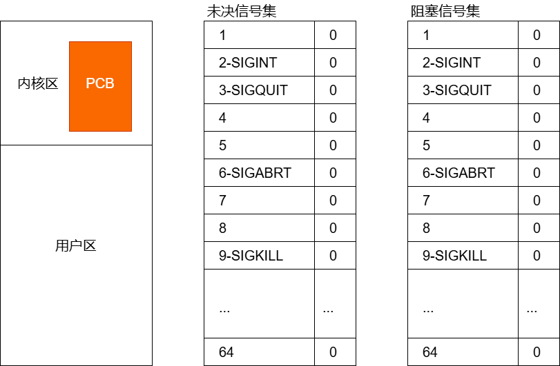

## 信号集

许多信号相关的系统调用都需要能表示一组不同的信号，多个信号可以使用一个称之为信号集的数据结构表示，其系统数据类型为 `sigset_t`

在 PCB 中有两个重要数据集

+   阻塞数据集
+   未决信号数据集

两个数据集都是内核使用**==位图机制==**来实现的。

### 对数据集的操作

+   操作系统不允许用户直接对两个数据集进行位操作
+   需要通过**信号集操作函数**来对 PCB 中的两个数据集进行修改

### 未决和阻塞

+   信号的“未决”是一种状态，指的是从信号的产生到信号被处理前的时间。
+   信号的“阻塞”是一个开关动作，指的是阻止信号被处理，但不阻止信号的产生。
+   信号的“阻塞”就是让系统暂时保留信号留待以后发送。由于“忽视”的存在，所以一般信号的阻塞只是暂时的，只是为了防止信号打断敏感操作。

### 未决信号集和阻塞信号集

- **未决信号集**：记录所有已产生但未被处理的信号（标志位为 `1`）。  
- **阻塞信号集**：决定哪些信号被临时屏蔽（标志位为 `1`），即使产生也不处理，直至解除阻塞。  



### **Unix-like系统信号捕捉流程**

**处理顺序**：信号产生 → 检查阻塞 → 处理未阻塞信号 → 清除未决状态。  

1. **信号产生（Creation）**  
    - 当事件触发（如用户输入`Ctrl+C`、系统调用、其他进程发送等），内核为目标进程生成信号，并标记于**未决信号集（Pending Signal Set）**。  
    - **未决信号集**：每个信号对应一个标志位，置为 `1` 表示信号已产生但未处理（未决状态），`0` 表示无未决信号。
2. **检查阻塞状态（Block Check）**  
    - 内核在将控制权交还给进程的用户态前（如系统调用返回、中断处理完毕），遍历未决信号集。  
    - 对于每个未决信号，检查**阻塞信号集（Block Signal Set）**：  
        - **阻塞信号集**：每个信号对应一个标志位，`1` 表示信号被阻塞（不传递），`0` 表示允许传递。  
        - **若信号被阻塞**：保持未决状态，暂不处理。  
        - **若未被阻塞**：进入信号处理阶段。
3. **信号处理（Handling）** 
    - **执行处理动作**：根据信号的处置方式（默认行为、忽略或用户自定义处理函数）执行操作。  
        - 若为自定义处理函数（Signal Handler），内核临时修改进程上下文，跳转执行该函数。  
        - 默认行为（如终止进程）或忽略（SIG_IGN）由内核直接处理。  
    - **处理期间的阻塞**：执行处理函数时，该信号通常被自动加入进程的阻塞信号集，防止重入。
4.  **更新未决信号集（Pending Set Update）**  
    - 信号处理完成后，内核清除未决信号集中对应标志位（置 `0`），表示信号已处理。  
    - 若信号在处理期间重复产生，常规信号仅保留一次未决状态，实时信号可能记录多次。

## 信号集操作相关函数

+   未决信号集是不允许用户修改的，用户只能获取；

+   以下几个操作函数操作的对象都是阻塞信号集

```C
#include <signal.h>
int sigemptyset(sigset_t *set);
int sigfillset(sigset_t *set);
int sigaddset(sigset_t *set, int signum);
int sigdelset(sigset_t *set, int signum);
int sigismember(const sigset_t *set, int signum);
```

### sigemptyset

功能：将 set 给出的信号集初始化为空，所有信号均从该集合中排除。

语法

```C
#include <signal.h>
int sigemptyset(sigset_t *set);
```

+   参数
    +   set：传出参数，需要操作的信号集
+   返回值
    +   成功：返回0
    +   失败：返回-1，并设置 errno

### sigfillset

功能：将 set 初始化为满，包括所有信号。

语法

```C
#include <signal.h>
int sigfillset(sigset_t *set);
```

+   参数
    +   set：传出参数，需要操作的信号集
+   返回值
    +   成功：返回0
    +   失败：返回-1，并设置 errno

### sigaddset

功能：从 set 中添加信号 signum

语法

```C
#include <signal.h>
int sigaddset(sigset_t *set, int signum);
```

+   参数
    +   set：传出参数，需要操作的信号集
    +   signum：信号值
+   返回值
    +   成功：返回0
    +   失败：返回-1，并设置 errno

### sigdelset

功能：从 set 中删除信号 signum

语法

```C
#include <signal.h>
int sigdelset(sigset_t *set, int signum);
```

+   参数
    +   set：传出参数，需要操作的信号集
    +   signum：信号值
+   返回值
    +   成功：返回0
    +   失败：返回-1，并设置 errno

### sigismember

功能：测试 signum 是否是 set 成员

语法

```C
#include <signal.h>
int sigismember(const sigset_t *set, int signum);
```

+   参数
    +   set：需要搜索的信号集
    +   signum：信号值
+   返回值
    +   成功：
        +   signum 是信号集成员：返回0
        +   signum 不是信号集成员：返回1
    +   失败：返回-1，并设置 errno


### sigprocmask

功能

+   将用户自定义的信号集中的数据设置到内核中
    +   设置阻塞 `SIG_BLOCK`
    +   解除阻塞 `SIG_UNBLOCK`
    +   替换 `SIG_SETMASK`

语法

```C
#include <signal.h>
int sigprocmask(int how, const sigset_t *set, sigset_t *oldset);
```

+   参数
    +   how：如何对内核阻塞信号集进行处理
        +   `SIG_BLOCK`：阻塞的信号集是内核中原有数据集与 set 数据集的并集。
            +   将用户设置的阻塞信号集添加到内核中，内核中原有的内核阻塞数据集不变。
            +   假设内核中的阻塞信号集为 mask，则结果为 mask | set。
        +   `SIG_UNBLOCK`：从阻塞信号集中移除 set 数据集中的信号。
            +   根据用户设置的信号集，从内核中的阻塞数据集中解除信号阻塞。
            +   假设内核中的阻塞信号集为 mask，则结果为 mask &= ~set。
        +   `SIG_SETMASK`：将被阻塞的信号集直接设置为 set 参数的值。
            +   将用户设置的阻塞信号集覆盖内核中原有的内核阻塞数据集。
    +   set：已经初始化好的用户自定义数据集。
    +   oldset：传出参数。可以为 `NULL`。
        +   如果非空的话，保存内核中原有的阻塞数据集。
+   返回值
    +   成功，0
    +   失败，-1，并设置错误号
        +   `EFAULT`
        +   `EINVAL`

### sigpending

功能

获取内核中的未决信号集

语法

```C
 #include <signal.h>
int sigpending(sigset_t *set);
```

+   参数
    +   set：传出参数，保存了内核中未决信号集信息
+   返回值
    +   成功：0
    +   失败：-1，并设置 errno