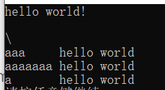
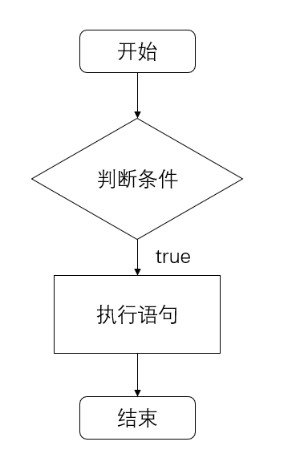
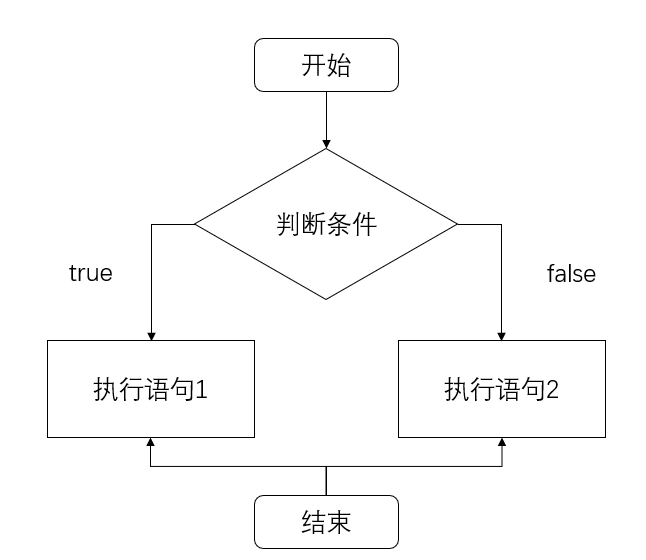
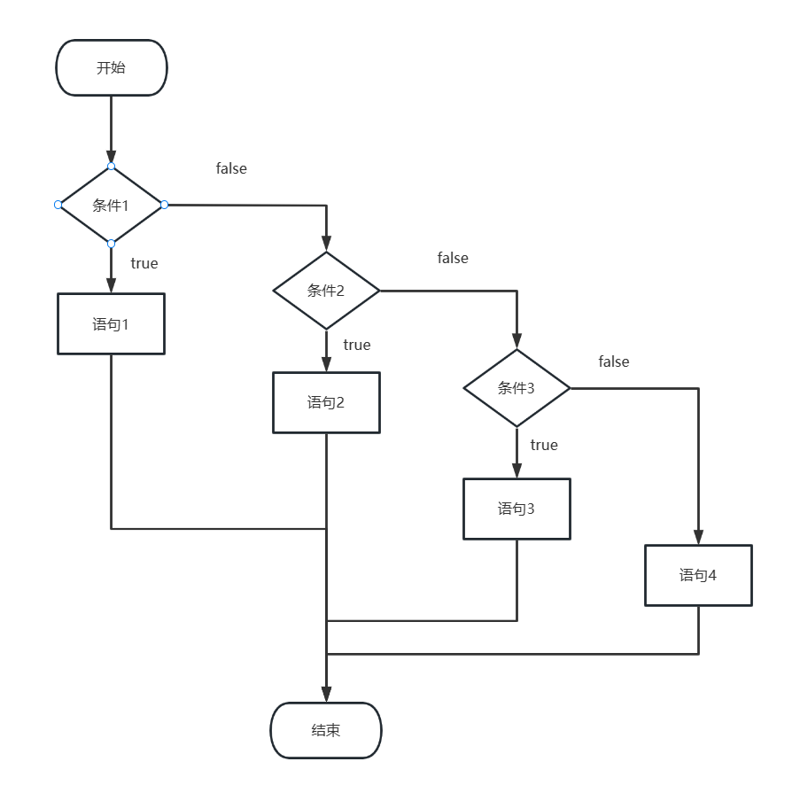
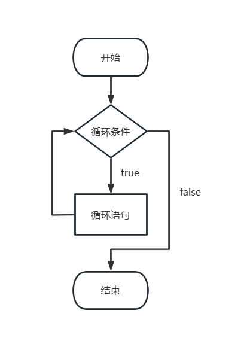
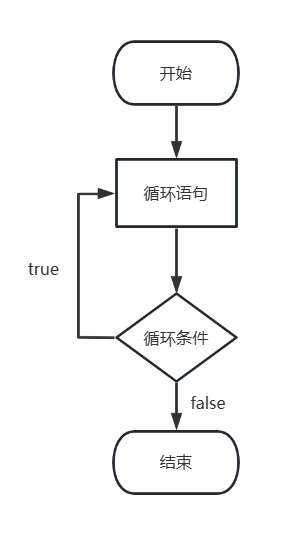

---
<<<<<<< HEAD
---

## lesson03 - 注释
=======
``
---

>>>>>>> temp

1. 单行注释

```c++
// 单行注释
```

2. 多行注释

```c++
/*多
  行
  注
  释
*/
```

## lesson04 - 变量

作用：给一段指定的内存空间命名，方便操作这一段内存

语法：`数据类型 变量名 = 变量初始值;`\

例子：

```c++
#include <iostream>
using namespace std;
int main() {
	//变量的声明格式：数据类型 变量名 = 变量初始值;
	int a = 10;
	cout << "对a的值打印：" << a << endl;
	system("pause");
	return 0;
}
```

## lesson05 - 常量

作用：定义不可更改的数据

定义常量的两种方式：

|                       | 语法                                  | 使用场景                                          | 特点                   |
| --------------------- | ------------------------------------- | ------------------------------------------------- | ---------------------- |
| `#define`定义的宏常量 | `#define 宏常量`                      | 一般在文件最开始定义，也就是main函数上面          | 不允许修改，修改会报错 |
| `const`修饰的变量     | `const 数据类型 变量名 = 变量初始值;` | 一般变量定义前，使用`const`关键字，修饰变量为常量 | 不允许修改，修改会报错 |

例子：

```c++
#include <iostream>
using namespace std;

//第一种方式：#define定义
#define day 7

int main() {

	cout << "一星期有" << day << "天" << endl;

	//第二种方式：const关键字修饰
	const int month = 12;
	cout << "一年有" << month << "个月" << endl;

	system("pause");
	return 0;
}
```

## lesson06 - 关键字

作用：C++中保留的单词(标识符)

注意：**给变量起名时，不能使用关键字**

## lesson07 - 标识符命名规则

1. 不能使用关键字作为标识符
2. 由字母、数字和下划线组成
3. 不能以数字开头
4. 标识符区分大小写

建议：标识符命名的标准为**见名知意**

## lesson08 - 数据类型：整型

数据类型的意义：

==**给变量分配一个合适的内存空间**==

整型类型变量的作用：整型变量表示整型类型的数据

整型类型中不同数据类型的区别：**占用空间大小不同**

| 数据类型  |                        占用空间                         |       取值范围       |
| :-------: | :-----------------------------------------------------: | :------------------: |
|   short   |                         2个字节                         | $-2^{15}$~$2^{15}-1$ |
|    int    |                         4个字节                         | $-2^{31}$~$2^{31}-1$ |
|   long    | windows占4个字节，linux中占4个字节(32位)，8个字节(64位) | $-2^{31}$~$2^{31}-1$ |
| long long |                         8个字节                         | $-2^{63}$~$2^{63}-1$ |

## lesson09 - 数据类型：sizeof关键字

作用：查询数据类型占用空间大小

语法：`size(数据类型/变量名)`

```c++
#include <iostream>
using namespace std;

int main() {
	/*
	* 预期：short:2; int:4; long:4; long long:8;
	sizeof()函数：
		语法：sizeof(变量类型/变量名)
	*/

	short num1 = 10;
	cout << "short类型变量所占用空间大小为：" << sizeof(short) << endl;
	cout << "使用变量名的方式，short类型变量所占用空间大小为：" << sizeof(num1) << endl;

	int num2 = 10;
	cout << "int类型变量所占用空间大小为：" << sizeof(int) << endl;

	long num3 = 10;
	cout << "long类型变量所占用空间大小为：" << sizeof(long) << endl;

	long long num4 = 10;
	cout << "long long类型变量所占用空间大小为：" << sizeof(long long) << endl;

	system("pause");
	return 0;
}
```

整型类型数据类型占用空间大小比较：`short < int <= long <= long long`

## lesson10 - 数据类型：实型（浮点型）

语法：

+ 单精度：`float ft = 3.14f`
  + 需要在小数后面加上`f`，这样计算机才会直接将小数作为float类型的变量值，否则，小数会按照double类型的变量值，然后再强转为float类型
+ 双精度：`double de = 3.14`
  + ==小数默认使用double==

float类型变量和double类型变量的区别是取值范围不同

| 数据类型 | 占用空间 | 取值范围        |
| -------- | -------- | --------------- |
| float    | 4个字符  | 7位有效数字     |
| double   | 8个字符  | 15-16位有效数字 |

## lesson11 - 数据类型：字符型

作用：字符型变量用于显示单个字符

语法：`char ch = 'a';`

> 1. 值为单个字符
> 2. 使用单引号

+ ==**c和c++中字符型变量所占空间大小为1个字节**==
+ 字符型变量不是直接将字符存储到内存中，而是将字符对应的ASCII码值存储到内中

```c++
#include <iostream>
using namespace std;

int main() {
	//字符型变量的创建方式
	char ch = 'a';
	cout << "ch" << ch << endl;

	//字符型变量所占空间大小
	cout << "字符型变量所占空间大小" << sizeof(char) << endl;

	//字符型变量常见错误
	//char ch1 = "b"; //错误使用双引号;字符型变量应该使用单引号
	//char ch2 = 'abc'; // 单引号内只能有一个字符;字符型变量的值是单个字符，而不是字符串

	//字符型变量对应的ASCII码值
	cout << "a对应的ASCII码值为：" << (int)ch << endl;

	system("pause");
	return 0;
}
```

## lesson12 数据类型：转义字符

由`\`和一个字母组成

三个常用转义字符

1. 换行符：`\n`
2. 反斜杠：`\\`
3. 制表符：`\t`

   连同制表符前面的字母共占八个输出位置，以保证制表符后面整齐的输出，如下图所示

```c++
#include <iostream>
using namespace std;

int main() {

	//常用转义字符
	//1. 换行符 "\n"
	cout << "hello world!\n" << endl;

	//2. 反斜杠 "\\"
	cout << "\\" << endl;

	//3. 水平制表符 "\t"
	cout << "aaa\thello world" << endl;
	cout << "aaaaaaa\thello world" << endl;
	cout << "a\thello world" << endl;

	system("pause");
	return 0;
}
```



## lesson13 - 数据类型：字符串型

作用：用于表示一串字符

语法：

1. C风格的字符串

   语法：`char ch[] = "aaaa";`

>字符串需要用**双引号**括起来
   >
>标识符后需要加`[]`

2. C++风格的字符串

   语法：`string st = "aaaa";`

   > 需要头文件`#include <string>`（虽然很多时候不加也不会报错）

```c++
#include <iostream>
#include <string>
using namespace std;

int main() {

	//C风格的字符串
	char ch[] = "abcde";
	cout << ch << endl;

	//C++风格的字符串
	string st = "abcde";
	cout << st << endl;


	system("pause");
	return 0;
}
```

> [!note ]
> ```C++
> string s = "ABC" + 'D';
> ```
> 上述`s`的结果不一定为`"ABCD"`
>
> 因为在C++中默认的字符串类型为`char*`，也就是上述代码中的`"ABC"` 的类型为`char*`
> 正确做法：
> ```C++
> // 1
> string s = string("ABC") + 'D';
> // 2
> string s = "ABC";
> s += 'D';
> ```

## lesson14 - 数据类型：布尔类型

作用：用于表示真和假

语法：`bool a = true;`

值：

+ `true` ： 真——本质上是`1`
+ `false`：假——本质上是`0`

布尔类型的数据占**一位字节**空间大小

布尔类型的数据非0便为真

```c++
#include <iostream>
using namespace std;

int main() {

	//真
	bool bo1 = true;
	//假
	bool bo2 = false;
	cout << bo1 << endl;
	cout << bo2 << endl;
	cout << sizeof(bool) << endl;


	system("pause");
	return 0;
}
```

结果：


## lesson 15 数据类型：数据输入

作用：获得键盘输入，给变量赋值

语法：`cin >> 变量`

```c++
#include <iostream>
#include <string>
using namespace std;
int main() {

	//整型数据输入
	int a = 0;
	cout << "输入整型数据" << endl;
	cin >> a;
	cout << "获得整型数据为a=" << a << endl;

	//字符串数据输入
	string st = "hello";
	cout << "输入字符串数据" << endl;
	cin >> st;
	cout << "字符串数据st = " << st << endl;

	system("pause");
	return 0;
}
```

## lesson 16 - 算术运算符：加减乘除运算

+ `+`：加
+ `-`：减
+ `*`：乘
+ `/`：除
  + ==**两个整数相除，结果仍为整数，结果会将小数部分去除**==
  + ==**除数不能为0**==
  + 小数可以做除运算，且结果可能是小数或整数

## lesson 17 - 算术运算符：取模运算

本质：求余

语法：`int a = b % c;`

**表达式的参数必须是整数或者是未区分范围的枚举类型**

除数为0时的输出结果为：

## lesson 18 - 算术运算符：递增递减

+ 前置递增

  语法：`++a`

+ 后置递增

  语法：`a++`

+ 前置后置区别
  + 前置：变量先加一，再进行表达式的计算
  + 后置：变量先进行表达式的计算，再加一

## lesson 19 - 赋值运算符

+ `=`
+ `+=`
+ `-=`
+ `*=`
+ `/=`
+ `%=`

## lesson 20 - 比较运算符

+ `==`
+ `!=`
+ `<`
+ `>`
+ `<=`
+ `>=`

## lesson 21 - 逻辑运算符：非

语法：`bool b = !a`

如果`a`为真，则`!a`为假；如果`a`为假，则`!a`为真。

==**C++中非0就是代表真**==

```c++
#include <iostream>
#include <string>
using namespace std;
int main() {

	int a = 10;

	cout << !a << endl;//输出0
	cout << !!a << endl;//输出1

	system("pause");
	return 0;
}
```

## lesson 22 - 逻辑运算符：与

语法：`bool c = a && b;`

a和b全为真时，c为真，否则c为假。

> 同真为真，其余为假

## lesson 23- 逻辑运算符：或

语法：`bool c = a || b;`

a和b任意一个为真，c为真，否则c为假。

> 同假为假，其余为真

## lesson 24 - 选择结构：单行if

### C++ 支持的三种程序运行结构

+ 顺序结构
+ 选择结构
+ 循环结构

### 单行if判断

if后条件语句为真，执行大括号内代码体；条件为假，不执行。

作用：执行满足条件的语句

执行流程：



代码：

```c++
#include <iostream>
using namespace std;

int main() {
	//选择结构-单行if语句
	//用户输入分数，如果分数大于600，视为考上一本大学，在屏幕上输出
	//获取分数
	int score = 0;
	cout << "输入分数" << endl;
	cin >> score;
	//打印分数
	cout << "您的分数是" << score << endl;

	//单行if判断
    //注意事项：条件语句后不能加分号
	if (score > 600) {
		cout << "您考上了一本大学" << endl;
	}
	return 0;
}
```

## lesson 25 - 选择结构：多行if

作用：条件为真，执行语句1；条件为假执行语句2

流程：



代码

```c++
#include <iostream>
using namespace std;

int main() {
	//选择结构-多行if判断
	//用户输入分数，如果分数大于600，则在屏幕上显示用户考上一本大学，否则，则在屏幕上显示用户为考上一本大学

	//输入分数
	int score = 0;
	cout << "输入一个分数" << endl;
	cin >> score;

	//打印分数
	cout << "您的分数是" << score << endl;

	//判断分数，大于600，在屏幕上打印考上一本大学，否则打印未考上一本大学
	if (score > 600) {
		cout << "您考上了一本大学" << endl;
	}
	else {
		cout << "您未考上一本大学" << endl;
	}


	return 0;
}
```

## lesson 26 - 选择结构：多条件if

作用：条件1为真，执行条件1对应的语句；条件2为真，执行条件2对应语句；…；条件全部都为假，执行else后语句

流程：



代码

```c++
#include <iostream>
using namespace std;

int main() {
	//选择结构-多行if判断
	//用户输入分数，如果分数大于600，则在屏幕上显示用户考上一本大学
	//分数大于500，则在屏幕上显示用户考上二本大学
	//分数大于400，则在屏幕上显示用户考上三本大学
	//前三个条件都为假，则在屏幕上显示用户未考上本科大学

	//输入分数
	int score = 0;
	cout << "输入一个分数" << endl;
	cin >> score;

	//打印分数
	cout << "您的分数是" << score << endl;

	//判断分数，大于600，在屏幕上打印考上一本大学
	//大于500，在屏幕上打印考上二本大学
	//大于400，在屏幕上打印考上三本大学
	//前三个条件都为假，在屏幕上打印未考上本科大学
	if (score > 600) {
		cout << "您考上了一本大学" << endl;
	}else if (score > 500) {
		cout << "您考上了二本大学" << endl;
	}
	else if (score > 400) {
		cout << "您考上了三本大学" << endl;
	}
	else {
		cout << "您未考上本科大学" << endl;
	}


	return 0;
}
```

## lesson 27 - 选择结构：嵌套if

作用：在if语句中嵌套if语句，做出更精准的判断

代码：

```c++
#include <iostream>
using namespace std;

int main() {
	//选择结构-多行if判断
	//用户输入分数，如果分数大于600，则在屏幕上显示用户考上一本大学
	//分数大于500，则在屏幕上显示用户考上二本大学
	//分数大于400，则在屏幕上显示用户考上三本大学
	//前三个条件都为假，则在屏幕上显示用户未考上本科大学
	//分数大于700，则在屏幕上显示用户考上清华大学
	//分数大于650，则在屏幕上显示用户考上北京大学
	//分数大于600，但小于等于650，则在屏幕上显示用户考上了人民大学

	//输入分数
	int score = 0;
	cout << "输入一个分数" << endl;
	cin >> score;

	//打印分数
	cout << "您的分数是" << score << endl;

	//判断分数，大于600，在屏幕上打印考上一本大学
	// 分数大于700，北京大学
	// 分数大于650，清华大学
	// 其次，人民大学
	//大于500，在屏幕上打印考上二本大学
	//大于400，在屏幕上打印考上三本大学
	//前三个条件都为假，在屏幕上打印未考上本科大学
	if (score > 600) {
		cout << "您考上了一本大学" << endl;
		if (score > 700) {
			cout << "您考上了清华大学" << endl;
		}
		else if (score > 650) {
			cout << "您考上了北京大学" << endl;
		}
		else {
			cout << "您考上了人民大学" << endl;
		}
	}else if (score > 500) {
		cout << "您考上了二本大学" << endl;
	}
	else if (score > 400) {
		cout << "您考上了三本大学" << endl;
	}
	else {
		cout << "您未考上本科大学" << endl;
	}


	return 0;
}
```

## lesson 28 - 选择结构案例 - 三只小猪称体重

题目：有三只小猪ABC，请分别输入三只小猪的体重，并且判断哪只小猪最重？

代码：

```c++
#include <iostream>
using namespace std;

int main() {
	//选择结构案例-三只小猪称体重
	//题目：有三只小猪ABC，请分别输入三只小猪的体重，并且判断哪只小猪最重？

	//输入三只小猪体重
	cout << "请输入三只小猪的体重" << endl;
	int pig1 = 0, pig2 = 0, pig3 = 0;
	cin >> pig1 >> pig2 >> pig3;


	//打印三只小猪体重
	cout << "甲：" << pig1 << endl;
	cout << "乙：" << pig2 << endl;
	cout << "丙：" << pig3 << endl;

	//输出最重的小猪名字
	if (pig1 > pig2) {
		if (pig1 > pig3) {
			cout << "最重的小猪是pig1" << endl;
		}
		else {
			cout << "最重的小猪是pig3" << endl;
		}
	}
	else {
		if (pig2 > pig3) {
			cout << "最重的小猪是pig2" << endl;
		}
		else {
			cout << "最重的小猪是pig3" << endl;
		}
	}
	
	return 0;
}
```

## lesson 29 - 选择结构案例 - 三目运算符

作用：实现简单判断

语法：`表达式1 ? 表达式2 : 表达式3`

+ 如果表达式1为真，返回表达式2
+ 如果表达式1为假，返回表达式3

注意：**==三目运算符的返回的是变量，这个变量可以被赋值==**

代码：

```c++
#include <iostream>
using namespace std;
int main() {
	int a = 10;
	int b = 20;
	int c = 0;
	cout << "a的值：" << a << endl;
	cout << "b的值：" << b << endl;
	cout << "c的值：" << c << endl;

	//比较a与b，将较大值赋值给c
    // 表达式1 a > b 为假，所以返回表达式3
	c = a > b ? a : b;
	cout << "三目运算后 - c的值：" << c << endl;

	//给三目运算符返回的变量赋值
    //三目运算符的返回的是变量，这个变量可以被赋值
	(a > b ? a : b) = 100;
	cout << "三目运算后 - a的值：" << a << endl;
	cout << "三目运算后 - b的值：" << b << endl;

	return 0;
}
```

## lesson 30 - 选择结构：switch

作用：多条件分支选择结构

语法：

```c++
switch(表达式){
    case 结果1: 
        执行语句;
        break;
    case 结果2:
        执行语句;
        break;
    case 结果3:
        执行语句;
        break;
    case ...
    default:
        执行语句;
        break;     
}
```

注意：

+ **==`switch`后括号内的表达式的值，只能为整型或者字符型==**
+ **==`switch`中，如果不加`break`，语句会一直继续执行==**

代码：

```c++
#include <iostream>
using namespace std;

int main() {
	//给电影打分
	//10 - 9：经典
	//8 - 7：非常好
	//6 - 5：一般
	//5以下：烂片

	//用户输入分数
	int score = 0;
	cout << "请对电影打分(1 - 10)" << endl;
	cin >> score;

	//打印用户输入的分数
	if (score < 1 || score > 10) return 0;
	else cout << "您对电影的打分为：" << score << endl;

	//根据用户输入的分数，在屏幕上打印对应选项
	switch (score) {
	case 10:
	case 9:
		cout << "您对电影的评价是：" << "电影经典" << endl;
		break;
	case 8:
	case 7:
		cout << "您对电影的评价是：" << "电影非常好" << endl;
		break;
	case 6:
	case 5:
		cout << "您对电影的评价是：" << "电影一般" << endl;
		break;
	default:
		cout << "您对电影的评价是：" << "mad，烂片" << endl;
		break;
	}
	system("pause");
	return 0;
}
```

总结：

+ switch优点：结构更为清晰，效率更高
+ 缺点：无法判断区间值，表达式的值只能为整型或者字符型

## lesson 31 - 循环结构：while

作用：符合循环条件，重复执行循环语句

语法：`while(循环条件){循环语句}`

流程：



代码：

```c++
#include<iostream>
using namespace std;

int main() {
	//循环结构 - while
	// 在屏幕上打印0-9
	int num = 0;
	while (num < 10) {
		cout << num++ << endl;
	}

	system("pause");
	return 0;
}
```

注意：

+ 执行循环语句时，程序需要提供退出循环的出口，否则会陷入死循环

## lesson 32 - 循环结构 - while案例 - 猜数字

题目：系统随机生成一个1到100之间的数字，玩家进行猜测，如果猜错，提示玩家数字过大或过小，如果猜对，恭喜玩家胜利，并且退出游戏

代码：

```c++
#include <iostream>
//#include<random>
using namespace std;
#include <ctime>

int main() {
	//循环结构 - while
	//题目：系统随机生成一个1到100之间的数字，玩家进行猜测
	//如果猜错，提示玩家数字过大或过小
	//如果猜对，恭喜玩家胜利，并且退出游戏

	//1.系统随机生成数字
	
	// C++ random库的方式
	// 使用mt19937，一个32位的梅森旋转算法的随机数生成器
	//std::random_device rd;
	//std::mt19937 gen(rd());
	//std::uniform_int_distribution<> distrib(0, 100);
	//int random_num = distrib(gen);
	
	// C 标准库的方式
	// 使用时间随机种子的方法
	srand((unsigned int)time(NULL));
	int random_num = rand() % 100 + 1;


	//2.用户输入数字，并与生成的数字比较
	int user_num = -1;
	while (user_num != random_num) {
		//用户输入数字
		cin >> user_num;
		//3.比较
		if (user_num > random_num) {
			cout << "您猜测的数字大了" << endl;
		}
		else if(user_num < random_num){
			cout << "您猜测的数字小了" << endl;
		}
	}
	cout << "恭喜您猜对了" << endl;
	cout << "生成的随机数为：" << random_num << endl;

	system("pause");
	return 0;
}
```

注意：**==可以使用`break`关键字跳出循环==**

## lesson 33 - 循环结构：dowhile

作用：满足循环条件，执行循环语句

语法：`do{循环语句}while(循环条件)`

流程：



代码：

```c++
#include <iostream>
using namespace std;

int main() {
	//循环结构 - do..while语句
	//在屏幕上打印0-9
	int num = 0;
	do {
		cout << num++ << endl;
	} while (num < 10);

	system("pause");
	return 0;
}
```

注意：与`while`循环的区别是，`do…while`循环是先执行一次循环语句，再进行循环条件的判断

## lesson 34 - 循环结构案例 - 水仙花数

题目：水仙花数是指一个3位数，它的每个位上的数字的3次幂之和等于它本身

例如：

$$
1^3 + 5^3 + 3^3 = 153
$$

请利用do…while语句，求出所有3位数中的水仙花数

代码：

```c++
#include <iostream>
using namespace std;

int main() {
	//循环结构 - do...while
	//题目：利用do...while语句，求出所有3位数中的水仙花数
	int num1 = 1, num2 = 0, num3 = 0;//三位数的每一位；num1百位；num2十位；num3个位
	int num = -1, res = -1, count = 0;//num保存三位数本身；res保存每个位上数字的三次幂之和；count是水仙花的计数
	do {
		num = num1 * 100 + num2 * 10 + num3;//计算出三位数本身
		res = pow(num1, 3) + pow(num2, 3) + pow(num3, 3);//计算出位数的三次幂和
		if (num == res) {
			cout << "第" << ++count << "个水仙花数为" << num << endl;
		}

		// 三位数递增
		num3++;
		if (num3 == 10) {
			num3 = 0;
			num2++;
		}
		if (num2 == 10) {
			num2 = 0;
			num1++;
		}
		if (num1 == 10) {//循环出口
			break;
		}
	} while (1);
	system("pause");
	return 0;
}
```

## lesson 35 - 循环结构：for循环

作用：满足循环条件，执行循环语句

语法：`for(表达式1;条件表达式;末尾循环体){循环语句}`

代码：

```c++
#include <iostream>
using namespace std;

int main() {
	//for循环
	//从数字0打印到数字9
	for (int i = 0;i<10;i++) {
		cout << i << endl;
	}

	system("pause");
	return 0;
}
```

## lesson 36 - 循环结构 - for循环案例 - 敲桌子

题目：从1开始数到数字100，如果数字个位含有7，或者数字十位含有7，或者该数字是7的倍数，我们打印敲桌子，其余数字直接打印输出

代码：

```c++
#include <iostream>
using namespace std;

int main() {
	//for循环
	//题目：从1开始数到数字100，如果数字个位含有7，
	//或者数字十位含有7，
	//或者该数字是7的倍数，我们打印敲桌子，
	//其余数字直接打印输出

	for (int i = 1; i <= 100; i++) {
		if (i % 10 == 7 || i / 10 == 7 || i % 7 == 0) {
			cout << "敲桌子" << endl;
		}
		else {
			cout << i << endl;
		}
	}
	system("pause");
	return 0;
}
```

## lesson 37 - 循环结构：嵌套循环

作用：为解决实际问题，在循环中再嵌套子循环

代码：

```c++
#include <iostream>
using namespace std;

int main() {
	//嵌套循环
	//题目：打印星图
	
	//外层循环
	for (int i = 1; i <= 10; ++i) {
		//内层循环
		for (int j = 1; j <= 10; ++j) {
			cout << "*";
		}
		cout << endl;
	}
	system("pause");
	return 0;
}
```

## lesson 38 - 循环结构 - 嵌套循环案例：乘法口诀表

题目：利用嵌套循环实现九九乘法表

代码：

```c++
#include <iostream>
using namespace std;

int main() {
	//嵌套循环
	//题目：利用嵌套循环，实现九九乘法表。
	for (int i = 1; i < 10; i++) {
		for (int j = 1; j <= i; j++) {
			cout << j << "*" << i << "=" << i * j << " ";
		}
		cout << endl;
	}
    system("pause");
    return 0;
}
```

## lesson 39 - 跳转语句 - break语句

作用：跳出选择或循环结构

使用时机：

+ switch中：终止当前case，并跳出switch
+ 循环结构中：跳出循环
+ 嵌套循环中：跳出最近的内层循环

## lesson 40 - 跳转语句 - continue语句

作用：在循环语句中，跳过`continue`后的语句，进入到下一次循环

## lesson 41 - 跳转语句 - goto语句

作用：无条件跳转语句

语法：`goto 标记;`、`标记:`

**==不推荐使用==**

## lesson 42 - 数组 - 一维数组 - 定义方式

特点：

+ 一段连续的内存空间
+ 数组中元素类型相同
+ 下标从0开始
+ 在定义时需要给出数组的长度

代码：

```c++
#include <iostream>
using namespace std;

int main() {
	//数组 - 一维数组
	//三种定义方法
	//1、int arr[个数]
	int arr[5];

	//利用数组下标进行赋值
	//数组下标从0开始
	arr[0] = 1;
	arr[1] = 2;
	arr[2] = 3;
	arr[3] = 4;
	arr[4] = 5;

	//利用数组下标访问数组中的元素
	//cout << arr[0] << endl;
	//cout << arr[1] << endl;
	//cout << arr[2] << endl;
	//cout << arr[3] << endl;
	//cout << arr[4] << endl;

	//2、int arr[个数] = {值1,值2,...}
	//没有赋值的元素，会默认赋值0
	int arr2[10] = { 1,2,3 };
	//利用循环遍历获取数组元素
	//for (int i = 0; i < 10; i++) {
	//	cout << arr2[i] << endl;
	//}

	//3、int arr[] = {值1,值2,...}
	int arr3[] = { 1,2,3 };
	for (int i = 0; i < 3; i++) {
		cout << arr3[i] << endl;
	}


	system("pause");
	return 0;
}
```

## lesson 43 - 数组 - 一维数组 - 数组名

用途：

+ 通过数组名可以获取数组所占内存空间大小
+ 通过数组名可以获取数组在内存空间的起始地址

代码：

```c++
#include <iostream>
using namespace std;

int main() {
	//数组 - 一维数组 - 数组名
	int arr[5] = { 1,2,3,4,5 };

	//通过数组名获得数组所占内存空间大小
	cout << "数组所占内存空间大小：" << sizeof(arr) << endl;
	cout << "数组中单个元素所占内存空间大小：" << sizeof(arr[0]) << endl;
	cout << "数组中元素个数为：" << sizeof(arr) / sizeof(arr[0]) << endl;

	//通过数组名获得数组在内存空间的起始地址
	cout << "数组在内存空间的起始地址：" << (int)arr << endl;
	cout << "数组中第一个元素在内存空间的起始地址" << (int) & arr[0] << endl;
	cout << "数组中第二个元素在内存空间的起始地址" << (int) & arr[1] << endl;

	//数组名是一个常量，不可以赋值
	//arr = 100;

	system("pause");
	return 0;
}
```

注意：**==数组名是一个常量，不可以被改变==**

## lesson 44 - 数组 - 一维数组案例 - 五只小猪称体重

题目：在一个数组中记录了五只小猪的体重，如`int arr[5] = {300,350,200,400,250}`

找出并打印最重的小猪体重

代码：

```c++
#include <iostream>
using namespace std;

int main() {

	//创建5只小猪体重的数组
	int arr[5] = { 300,350,200,400,250 };
	
	//从数组中找到最大值
	int max_pig = -1,tag = 0;
	for (int i = 0; i < 5; i++) {
		if (arr[i] > max_pig) {
			max_pig = arr[i];
			tag = i;
		}
	}
	cout << "最重的小猪是第" << tag+1 << "只" << endl;
	cout << "它的体重是" << max_pig << endl;

	system("pause");
	return 0;
}
```

## lesson 45 - 数组 - 一维数组案例 - 数组元素倒置

**题目：**请声明一个5个元素的数组，并且将元素倒置

（如原数组元素为：`1,3,2,5,4`；倒置后为`4,5,2,3,1`）

**代码：**

```c++
#include <iostream>
using namespace std;

int main() {

	//题目：请声明一个5个元素的数组，并且将元素倒置
	//声明并定义五个元素的数组
	int arr[5] = { 300,350,200,400,250 };

	//打印数组
	for (int i = 0; i < 5; i++) {
		cout << arr[i] << " ";
	}
	cout << endl;

	//倒置
	int length_arr = sizeof(arr) / sizeof(arr[0]);
	int end = length_arr - 1;
	for (int i = 0; i < (length_arr/2 + 1); i++) {
		int temp = arr[i];
		arr[i] = arr[end - i];
		arr[end - i] = temp;
	}

	//打印数组
	for (int i = 0; i < 5; i++) {
		cout << arr[i] << " ";
	}
	cout << endl;
	
}
```

## lesson 46 - 数组 - 一维数组 - 冒泡排序

**作用：**对数组内元素进行排序

1. 比较相邻元素的大小，如果逆序，就将两个元素置换
2. 对每一对相邻元素进行比较，这为一趟比较，最后选择出一个最值
3. 重复第2步，每进行一趟比较，每一趟中的比较次数减一，一直到整个数组有序

**代码：**

```c++
#include <iostream>
using namespace std;

int main() {

	int arr[10] = {2, 4, 0, 50, 7, 1, 3, 8, 9, 6};
	int length_arr = sizeof(arr) / sizeof(arr[0]);
	//打印数组
	for (int i = 0; i < length_arr; i++) {
		cout << arr[i] << " ";
	}
	cout << endl;

	for (int j = 0; j < length_arr - 1; j++) {
		//一趟
		for (int i = 0; i < length_arr - j - 1; i++) {
			//逆序交换元素
			if (arr[i] > arr[i + 1]) {
				int temp = arr[i];
				arr[i] = arr[i + 1];
				arr[i + 1] = temp;
			}
		}
	}

	//打印数组
	for (int i = 0; i < length_arr; i++) {
		cout << arr[i] << " ";
	}
	cout << endl;

	system("pause");
	return 0;
}
```

## lesson 47 - 数组 - 二维数组 - 定义方式

**二维数组的四种定义方式：**

1. `int arr[行数][列数];`

   `arr[0][0] = value1;`

   `arr[0][1] = value2;`

   `…`

2. `int arr[行数][列数] = {{value11, value12, …},{value21, value22, …}}`
3. `int arr[行数][列数] = {value1, value2, value3, …}`
4. `int arr[][列数] = {value1, value2, value3, …}`

**注意：**二维数组声明的时候，如果初始化了数据，则二维数组的行数是可以忽略的

## lesson 48 - 数组 - 二维数组 - 数组名

**作用：**

+ 获得二维数组所占内存空间大小
+ 获得二维数组在内存空间中的起始地址

**代码：**

```c++
#include <iostream>
using namespace std;

int main() {

	//二维数组 - 数组名

	//创建一个二维数组
	int arr[2][3] = { {1,2,3},{4,5,6} };

	//获取二维数组所占内存空间大小
	cout << "二维数组所占内存空间大小为：" << sizeof(arr) << endl;
	cout << "二维数组第一行所占内存空间大小为：" << sizeof(arr[0]) << endl;
	cout << "二维数组第一个元素所占内存空间大小" << sizeof(arr[0][0]) << endl;
	cout << "二维数组共有" << sizeof(arr) / sizeof(arr[0]) << "行" << endl;
	cout << "二维数组共有" << sizeof(arr[0]) / sizeof(arr[0][0]) << "列" << endl;

	//获取二维数组所在内存空间的起始地址
	cout << "二维数组所在内存空间的起始地址" << (int)arr << endl;
	cout << "二维数组第一行所在内存空间起始地址" << (int)arr[0] << endl;
	cout << "二维数组第二行所在内存空间起始地址" << (int)arr[1] << endl;
	cout << "二维数组第一个元素所在内存空间起始地址" << (int)&arr[0][0] << endl;
   
  	system("pause");
	return 0;
}
```

## lesson 49 - 数组 - 二维数组应用案例 - 考试成绩统计

**题目：**三名同学（张三、李四、王五），在一次考试中的成绩分别如下表，**请分别输入三名同学的总成绩**

|      | 语文 | 数学 | 英语 |
| ---- | ---- | ---- | ---- |
| 张三 | 100  | 100  | 100  |
| 李四 | 90   | 50   | 100  |
| 王五 | 60   | 70   | 80   |

**代码：**

```c++
#include <iostream>
using namespace std;

int main() {

	//二维数组应用案例 - 考试成绩统计
	//题目：给出三名同学成绩，输出各自总成绩
	
	//创建存放三名同学的二维数组
	int arr[3][3] = { {100,100,100},{90,50,100},{60,70,80} };
	string arr1[3] = { "张三","李四","王五" };

	//对三个同学成绩各自求和并输出
	int length_row_arr = sizeof(arr) / sizeof(arr[0]);//行数
	int length_col_arr = sizeof(arr[0]) / sizeof(arr[0][0]);//列数
	for (int i = 0; i < length_row_arr; i++) {
		int sum = 0;
		for (int j = 0; j < length_col_arr; j++) {
			sum += arr[i][j];
		}
		cout << arr1[i] << "同学的总成绩为" << sum << endl;
	}

	system("pause");
	return 0;
}
```

## lesson 50 - 函数 - 函数的定义

**作用：**将常用的代码封装到一起，减少重复代码

对于大型程序，会根据功能将代码分割为若干个代码块

**定义步骤：**

1. 返回值类型：定义函数需要返回的值的类型
2. 函数名：使用函数名调用该函数
3. 参数列表：使用函数时传入的参数
4. 函数体语句：函数功能代码
5. 返回值：返回正确结果，数据类型需要和函数的返回值类型保持一致

**语法：**

```c++
返回值类型 函数名(参数列表){
    函数体语句;
    
    return 语句;
}
```

**示例代码：**输入变量a和b，求和

```c++
int sum_two_num(int a,int b){
	return a + b;
}
```

## lesson 51 - 函数 - 函数的调用

**作用：**调用定义好的函数

**语法：**`函数名(参数)`

**代码：**

```c++
#include <iostream>
using namespace std;

int sum_two_num(int a,int b){
	return a + b;
}

int main() {

	int a = 10, b = 20;
	int sum = sum_two_num(10, 20);
	cout << a << "和" << b << "的和为：" << sum << endl;

	system("pause");
	return 0;
}
```

**注意：**

+ 函数定义时参数列表中的参数为形参
+ 函数调用时输入的参数为实参
+ 实参的值会传递给形参

## lesson 52 - 函数 - 值传递

+ 在函数调用时，将实参的值传递给形参
+ **==值传递中，形参发生任何改变，不会影响实参==**

**详解：**

+ 场景：
  + 在函数A中调用函数B
  + 函数A中实参为`A1`，`A2`，`函数B(A1, A2);`
  + 函数B中形参为`B1`，`B2`，`函数B(B1, B2);`
+ 函数A中的变量`A1`、`A2`，有其独立的内存空间
+ 当函数调用时，会为形参`B1`、`B2`开辟一个单独的临时内存空间
+ 同时，将实参的值，复制给对应的形参
+ 之后在函数B中，任何对形参的操作，都是在形参对应的内存空间上进行的
+ 也就是说，没有对实参的内存空间进行任何的操作
+ 所以，在值传递中，形参无论发生什么变化，不会影响实参

**示例：**

```c++
#include <iostream>
using namespace std;


//定义函数，实现两个数字进行交换的函数
void swap(int num1, int num2) {

	cout << "swap函数内，交换前，num1 = " << num1 << endl;//10
	cout << "swap函数内，交换前，num2 = " << num2 << endl;//20

	int temp = num1;
	num1 = num2;
	num2 = temp;

	cout << "swap函数内，交换后，num1 = " << num1 << endl;//20
	cout << "swap函数内，交换后，num2 = " << num2 << endl;//10

	return;//不需要返回值，或者说返回值类型为void时，return语句可以忽略

}


int main() {

	int num1 = 10, num2 = 20;

	swap(num1, num2);

	cout << "main函数中，交换后，num1 = " << num1 << endl;//10
	cout << "main函数中，交换后，num2 = " << num2 << endl;//20

	system("pause");
	return 0;
}
```

## lesson 53 - 函数 - 常见的样式

+ 无参无返
+ 有参无返
+ 无参有返
+ 有参有返

## lesson 54 - 函数 - 函数的声明

**作用：**告诉编辑器函数名以及函数的调用方法，函数的定义可以单独另写

**语法：**`返回值类型 函数名(参数列表);`

**注意：**

+ 函数可以声明多次，但只能定义一次
+ 函数声明后，函数的定义可以写到`main()`函数后面

## lesson 55 - 函数 - 函数的分文件编写

**作用：**使代码结构更清晰

**步骤：**

1. 创建`函数名.h`的头文件
2. 创建`函数名.cpp`的源文件
3. 在头文件中写函数的声明
4. 在源文件中，引入函数的头文件，并写函数的定义
5. 调用时，在主文件中引入函数的头文件

**头文件代码：**

```c++
#include <iostream>
using namespace std;

//函数的声明
void swap(int a, int b);
```

**源文件代码：**

```c++
#include "swap.h"

void swap(int a, int b) {
	int temp = a;
	a = b;
	b = temp;
	cout << "a = " << a << endl;
	cout << "b = " << b << endl;

}
```

**主文件调用代码：**

```c++
#include <iostream>
using namespace std;
#include "swap.h"

int main() {

	int a = 10, b = 20;
	swap(a, b);

	system("pause");
	return 0;
}
```

## lesson 56 - 指针 - 指针的定义和使用

作用：通过指针间接访问内存空间

>+ 内存编号是从0开始的，一般使用十六进制显示
>+ 指针中存放的是其指向变量的内存地址

定义语法：

```c++
变量类型* 指针名;
指针名 = &变量名;
```

使用方法：使用解引用的方法，可以通过指针访问其存储的内存空间中存放的数据

```c++
*指针名;
```

代码：

```c++
#include <iostream>
using namespace std;

int main() {

	//指针-指针的定义与使用

	int a = 10;

	//声明一个指针
	int* p;
	//在指针中保存a的地址
	p = &a;

	cout << "a的地址为" << &a << endl;
	cout << "p = " << p << endl;

	//使用一个指针
	//可以使用解引用的方式，得到指针指向的内存空间中保存的数据
	//在指针变量前加 * 是解引用
	*p = 1000;
	cout << "a = " << a << endl;
	cout << "*p = " << *p << endl;


	system("pause");
	return 0;
}
```

## lesson 57 - 指针 - 指针所占内存空间

+ 在**==32位==**操作系统下，指针占**==4个字节==**内存空间
+ 在**==64位==**操作系统下，指针占**==8个字节==**内存空间

## lesson 58 - 指针 - 空指针

指向编号为0的内存空间

作用：给指针初始化

注意：**空指针指向的内存是不可以访问的**

> 0~255编号的内存空间被系统占用，不允许用户访问

代码：

```c++
#include <iostream>
using namespace std;

int main() {

	// 指针 - 空指针

	//使用空指针给指针初始化
	int* p = NULL;
	
	//空指针指向的内存不可以被访问
	//*p = 1000;//报写入权限冲突错误

	system("pause");
	return 0;
}
```

## lesson 59 - 指针 - 野指针

指向非法内存空间的指针

或者说，指针的指向是未知的(随机的、不正确的、没有明确限制的)

**产生原因：释放内存后不及时置空，依旧指向了该内存，可能出现非法访问的错误**

**严防野指针**

> 严防野指针的技巧：
>
> 1. 定义指针时将指针初始化为NULL
> 2. 给指针分配空间后判空
> 3. 释放指针后立即将指针置空
> 4. 使用智能指针
>
> ```c++
> int* a = NULL; //定义指针时将指针初始化为NULL
> a = (int*)malloc(sizeof(int)*n);
> assert(a != NULL);// 分配内存空间后判空
> free(a);
> a = NULL; // 释放后立即置空
> ```

## lesson 60 - 指针 - const 修饰指针

**三种情况：**

1. const修饰指针——常量指针

   **语法：**`const int * 指针名 = 变量名;`

   **特点：**

   + 指针指向可以改
   + 指针指向的值不可以改

2. const修饰常量——指针常量

   **语法：**`int * const 指针名 = 变量名;`

   **特点：**

   + 指针指向不可以改
   + 指针指向的值可以改

3. const修饰指针和常量

   **语法：**`const int * const 指针名 = 变量名;`

   **特点：**

   + 指针的指向不可以改
   + 指针指向的值也不可以改

**示例代码：**

```c++
#include <iostream>
using namespace std;

int main() {

	// 指针 - const修饰指针
	int a = 20;
	int b = 30;
	//1.const修饰指针 —— 常量指针
	const int* p = &a;
    int const* p = &a; // 与上一句等价
	
	p = &b; // 常量指针指向可以改
	//*p = 10;//常量指针指向的值不可以改

	//2.const修饰常量 —— 指针常量
	int* const p1 = &a;
	//p1 = &b;//指针常量的指向不可以改
	*p1 = 10;//指针常量指向的值可以改

	//3.const修饰指针和常量
	const int* const p2 = &a;
	//p2 = &b;//指向不可以改
	//*p2 = 10;//指向的值也不可以改

	system("pause");
	return 0;
}
```

> 技巧：看 const 修饰的对象是什么
>
> 比如`const int* p`和`int const* p`，const修饰的是`int *`或者说是`*`，也就意味着，这里的**指针是个常量**，所以指针的值——指针中存的地址是不可以改的，也就是指针的指向不可以改，但指针内地址中存储的值是可以改的，也就是指向的值可以改；
>
> 而`int* const p`，const 修饰的是 p，也就是 p 是常量，相当于**指针指向了一个常量**，也就是说，指针的指向是可以改的，而指针指向的值是不可以改的；
>
> `const int* const p`就不用说了，指针的指向和指向的值都是不可以改的。

## lesson 61 - 指针 - 指针和数组

**作用：**利用指针访问数组元素

**代码：**

```c++
#include <iostream>
using namespace std;

int main() {

	// 指针 - 指针和数组
	
	int arr[10] = { 1,2,3,4,5,6,7,8,9,10 };

	int* p = arr;//数组名就是数组的首地址

	cout << "使用数组下标索引第一个元素为：" << arr[0] << endl;
	cout << "使用指针索引第一个元素为：" << *p << endl;

	p++;//指针向后偏移4个字节（由于指针声明时，变量类型为int，所以自增偏移4个字节）

	cout << "使用指针偏移的方式，索引第二个元素为：" << *p << endl;

	cout << "使用指针索引的方式，遍历数组: " ;
	int* p2 = arr;
	for (int i = 0; i < 10; i++) {
		cout << *p2++ << " ";
	}
	cout << endl;

	system("pause");
	return 0;
}
```

注意：

> 自增运算符`++`、`--`的优先级高于一元运算符`*`，所以`*p++`，等价于`*(p++)`，是对指针的偏移操作，而`(*p)++`，则是对`p`指针指向的内存空间中保存的数据进行自增操作

**概念**：

+ 数组：多个相同类型数据的集合，存储在一段连续的内存空间里，数组名就是内存的首地址
+ 指针：是一个特殊的变量，变量的值为另一个相同类型的变量的内存地址。指针名指向了指向的变量的内存的首地址

**区别**：

1. **赋值方式不同**。相同类型的指针可以互相复制，而数组只能通过一个元素一个元素复制。
2. **存储方式不同**：
   + 数组中的元素在内存中是连续的，其开辟一段连续的内存空间。而且一般数组都开辟在栈区，或者全局数组开辟在静态存储区。
   + 指针却是灵活的。指针是一个变量，

## lesson 62 - 指针 - 指针和函数 - 地址传递

+ 函数的参数可以是指针的
+ 通过指针进行的参数传递，叫做地址传递
+ **==在地址传递中，改变形参的值，实参也会被改变==**

**详解：**

+ 场景：
  + 函数A中调用函数B
  + 函数A中实参为`A1`、`A2`，`函数B(&A1, &A2);`
  + 函数B中形参为`B1`、`B2`，`函数B(*B1, *B2);`
+ 在函数B被调用时，将函数A中实参`A1`和`A2`的地址传递给函数B中的形参`B1`和`B2`
+ 也就是说，形参`B1`和`B2`，是`A1`和`A2`的指针，二者内存空间中存放的是`A1`、`A2`的地址
+ 当形参`B1`、`B2`解引用后，指向的内存空间就是`A1`、`A2`分配的内存空间
+ 当通过`*B1`和`*B2`对内存空间中存放的值进行改变时，其实就是在改变`A1`和`A2`的值
+ 所以，在地址传递中，改变形参的值，实参也会被改变

代码：

```c++
#include <iostream>
using namespace std;

void swap_point(int* a, int* b);

int main() {

	// 指针 - 指针和函数 - 地址传递

	int a = 10;
	int b = 20;

	swap_point(&a, &b);

	cout << "a = " << a << endl;
	cout << "b = " << b << endl;

	system("pause");
	return 0;
}
void swap_point(int* a, int* b) {
	int temp = *a;
	*a = *b;
	*b = temp;
}
```

## lesson 63 - 指针 - 指针配合数组和函数案例 - 冒泡排序

题目：封装一个函数，利用冒泡排序，实现对整型数组的升序排序

例如：数组 - `int arr[10] = {4,3,6,9,1,2,10,8,7,5};`

代码：

```c++
#include <iostream>
using namespace std;

void print_arr(int* a,int length);
void swap(int* a, int* b);
void sort_by_point(int* a,int length);
int main() {

	// 指针 - 指针配合数组和函数案例 - 冒泡排序
	//题目：封装一个函数，利用冒泡排序，实现对整型数组的升序排序封装一个函数

	//创建数组，并获得数组长度
	int arr[10] = { 4,3,6,9,1,2,10,8,7,5 };
	int length = sizeof(arr) / sizeof(arr[0]);
    
    //打印排序前的数组
	print_arr(arr, length);
    
    //排序
	sort_by_point(arr, length);
    
    //打印排序后的数组
	print_arr(arr, length);

	system("pause");
	return 0;
}

//打印数组
void print_arr(int* a, int length) {
	for (int i = 0; i < length; i++) {
		std::cout << *a++ << " ";
	}
	std::cout << endl;
}

//交换函数
void swap(int* a, int* b) {
	int temp = *a;
	*a = *b;
	*b = temp;
}
//冒泡排序
//参数a：数组的头指针
//参数lentgh：数组长度
void sort_by_point(int* a, int length) {

	int* p = a;

	for (int j = 0; j < length - 1; j++) {
		p = a;
		//一趟
		for (int i = 0; i < length - j - 1; i++) {
			if (*p > *(p+1)) {
				//交换
				swap(p, p+1);
			}
			p++;
		}
	}
}
```

注意：

> 使用指针对数组遍历的错误方法：
>
> ```c++
> *p = arr;
> 
> while(*p != NULL){
>     cout << *p++ << endl;
> }
> ```
>
> 因为在指针`p`越界后，`p`指向的变量不一定是空值

> 传递数组的方法：
>
> ```c++
> //int arr[10] = { 4,3,6,9,1,2,10,8,7,5 };
> 
> 返回值 函数名(int * arr, int len){...}
> 
> //或者 
> 
> 返回值 函数名(int arr[10]){...}//注意：是要有确切的长度
> ```

## lesson 64 - 结构体 - 结构体的定义与使用

作用：创建自定义变量类型

语法：

```c++
struct 结构体名{
    变量类型 变量名;
    变量类型 变量名1；
};
```

或者，可以在定义结构体时，声明一个结构体变量

```c++
struct 结构体名{
    变量类型 变量名;
    变量类型 变量名1；
}结构体变量名;
```

结构体构建的三种方法：

1. 先创建，再使用`.`，调用属性赋值
2. 创建时初始化
3. 定义时创建，再使用`.`，调用属性赋值

代码：

```c++
#include <iostream>
using namespace std;

struct student {
	//姓名
	string name;
	//年龄
	int age;
	//分数
	int score;
} student3;//第三种创建方法 

int main() {
	
	//结构体 - 结构体的创建
	// 示例：学生结构体，学生包括（姓名，年龄，分数）
	//三种方法：
	//1.声明，然后再赋初值
	struct student student1;
    //student student1 //这种也是可以的，在c++中，结构体声明变量时，可以忽略关键字struct
	student1.name = "李四";
	student1.age = 18;
	student1.score = 100;
	cout << "姓名：" << student1.name <<" ";
	cout << "年龄：" << student1.age << " ";
	cout << "分数：" << student1.score << endl;

	//2.创建时初始化
	struct student student2 = { "王五", 28, 80 };
	cout << "姓名：" << student2.name << " ";
	cout << "年龄：" << student2.age << " ";
	cout << "分数：" << student2.score << endl;

	//3.定义时顺便创建，然后再赋值
	student3.name = "张三";
	student3.age = 39;
	student3.score = 99;
	cout << "姓名：" << student3.name << " ";
	cout << "年龄：" << student3.age << " ";
	cout << "分数：" << student3.score << endl;


	system("pause");
	return 0;
}
```

注意：

> 结构体在声明变量时，可以忽略关键字struct
>
> 结构体在定义时，不要忘了`;`

> struct 在 C 和 C++ 之间的区别：
>
> 1. C 结构体中不允许有函数存在，C++ 结构体中允许有成员函数
>
> 2. C 结构体的默认控制权限位public且不允许更改，而C++ 的控制权限可以有public、protected、private三种(默认也是public)
>
>    > 注意：这点也是和C++中类的区别，C++中类的默认控制权限为private
>
> 3. C 结构体不能继承，而 C++ 的结构体是可以从其他结构体和类继承的
>
> 4. C 结构体在使用时必须带上关键字 struct 或者 使用 typedef 关键字取别名，而C++ 结构体可以直接省略 struct 关键字进行使用
>
> |          | C                        | C++                                  |
> | -------- | ------------------------ | ------------------------------------ |
> | 静态成员 | 不允许                   | 允许                                 |
> | 成员函数 | 不允许                   | 允许                                 |
> | 控制权限 | public                   | public\protected\private(默认public) |
> | 继承关系 | 不允许                   | 可从其他结构体和类继承               |
> | 初始化   | 不可以直接初始化数据成员 | 可以                                 |
> | 使用     | 带关键字struct(或取别名) | 可以直接使用                         |

## lesson 65 - 结构体 - 结构体数组

使用下标访问数组中的结构体变量

使用`.`访问结构体变量中的属性

## lesson 66 - 结构体 -结构体指针

结构体指针使用`->`访问结构体的属性

语法：

```c++
struct 结构体名 * p = &结构体变量;

p -> 结构体变量.结构体属性;
```

## lesson 67 结构体 - 嵌套结构体

结构体成员列表中可以有其他结构体变量

对成员结构体的属性进行赋值和获取时，可以通过`结构体名称.成员结构体名称.成员结构体属性`的方式

## lesson 68 - 结构体 - 结构体做函数参数

两种传递方式：

1. 值传递
2. 地址传递

代码：

```c++
#include <iostream>
using namespace std;

//学生结构体
struct student {
	//姓名
	string name;
	//年龄
	int age;
	//分数
	int score;
};

//值传递
void printStudent(student s) {
	cout << "姓名：" << s.name << " ";
	cout << "年龄：" << s.age << " ";
	cout << "分数：" << s.score << endl;
}

void printStudent2(student *s) {
	cout << "姓名：" << s->name << " ";
	cout << "年龄：" << s->age << " ";
	cout << "分数：" << s->score << endl;
}
int main() {
	
	//结构体 - 结构体做函数的参数
	student student1;
	student1.name = "李四";
	student1.age = 18;
	student1.score = 100;
    
    printStudent(student1);//值传递
	printStudent2(&student1);//地址传递
	
	system("pause");
	return 0;
}
```

注意：

> 值传递时，结构体访问属性使用的是操作符`.`
>
> 地址传递时，结构体变量访问属性使用的是操作符`->`

> 值传递，形参改变，不改变主函数中的实参
>
> 地址传递，形参改变，主函数中的实参也会发生改变

## lesson 69 - 结构体 - const修饰结构体变量

作用：防止误操作

代码：

```c++
#include <iostream>
using namespace std;

struct student {
	//姓名
	string name;
	//年龄
	int age;
	//分数
	int score;
};

void printStudent(const student *s) {
	//s->name = "新名词";//const限制写入操作
	cout << "姓名：" << s->name << " ";
	cout << "年龄：" << s->age << " ";
	cout << "分数：" << s->score << endl;
}
int main() {
	
	//结构体 - const修饰结构体
	student student1;
	student1.name = "李四";
	student1.age = 18;
	student1.score = 100;
	printStudent(&student1);
	
	system("pause");
	return 0;
}
```

注意：

> + 使用const对传入地址传递的函数中的形参禁止写的操作，以防出错
> + 值传递的缺点是如果是多个人同时调用同一个函数，会同时创建额外的很多内存空间共函数使用
> + 地址传递有效避免上述问题，节省内存空间

## lesson 70 - 结构体 - 结构体案例1

题目：学校正在做毕设项目，每名老师带领5个学生，总共3名老师，需求如下：

设计学生和老师的结构体，其中老师的结构体中，有老师的姓名和一个存放5名学生的数组作为成员；

学生的成员有姓名、考试分数；创建数组存放3名老师，通过函数给每个老师及所带的学生赋值；

最终打印老师数据以及老师所带的学生的数据

代码：

```c++
#include <iostream>
using namespace std;

struct student {
	//姓名
	string name;
	//分数
	int score;
};

struct teacher {
	//老师姓名
	string name;
	//学生数组
	struct student stu[5];
};
//输入老师的信息
void cinTeacher(teacher* t, int num);

//自动赋值
void createTeacher(teacher* t, int num);

//打印老师的信息
void printTeacher(teacher *t, int length);

int main() {
	
	//结构体 - 结构体案例1 - 老师学生信息
	teacher t[3];
	//cinTeacher(t, 3);
	createTeacher(t, 3);
	printTeacher(t,3);
	
	system("pause");
	return 0;
}

void createTeacher(teacher* t, int num) {
	string createA = "ABCDE";
	string teacherNamePre = "teacher_";
	string studentNamePre = "student_";
	for (int i = 0; i < num; i++) {
		t[i].name = teacherNamePre + createA[i];
		for (int j = 0; j < 5; j++) {
			t[i].stu[j].name = studentNamePre + createA[i] + createA[j];
			t[i].stu[j].score = rand()%100;
		}
	}
}

void cinTeacher(teacher* t, int num) {
	for (int i = 0; i < num; i++) {
		cout << "请输入第" << i+1 << "名老师的姓名：" << endl;
		cin >> t[i].name;
		for (int j = 0; j < 5; j++) {
			cout << "请输入" << t[i].name << "老师第" << j+1 << "名学生的姓名：" << endl;
			cin >> t[i].stu[j].name;
			cout << "请输入" << t[i].stu[j].name << "同学的分数：" << endl;
			cin >> t[i].stu[j].score;
		}
	}
}

void printTeacher(teacher *t, int length) {
	for (int j = 0; j < length; j++) {
		cout << "第" << j+1 << "名老师的姓名为：" << t[j].name << endl;
		for (int i = 0; i < 5; i++) {
			cout << "学生" << i + 1 << "的姓名为：" << t[j].stu[i].name << " 他的分数为：" << t[j].stu[i].score << endl;
		}
	}
	cout << endl;
}
```

## lensson 71 - 结构体 - 结构体案例2

题目：设计一个英雄的结构体，包括成员姓名，年龄，性别；

创建结构体数组，数组中存放5名英雄

通过冒泡排序的算法，将数组中的英雄按照年龄进行升序排序，最终打印排序后的结果

五名英雄的信息如下：

```c++
	{"刘备", 23, "男"}，
    {"关羽", 22, "男"},
	{"张飞", 20, "男"},
	{"赵云", 21, "男"},
	{"貂蝉", 19, "女"}
```

代码：

```c++
#include <iostream>
using namespace std;

struct hero {
	string name;
	int age;
	string sex;
};


void bubbleSort(hero* h, int num);

int main() {

	hero heros[5] = {
		{"刘备", 23, "男"},
	{"关羽", 22, "男"},
	{"张飞", 20, "男"},
	{"赵云", 21, "男"},
	{"貂蝉", 19, "女"}
	};
	bubbleSort(heros, 5);
	for (int i = 0; i < 5; i++) {
		cout << "name：" << heros[i].name << " age：" << heros[i].age << " sex：" << heros[i].sex << endl;
	}

	system("pause");
	return 0;
}


void bubbleSort(hero* h, int num) {
	hero temp;
	for (int i = 0; i < num-1; i++) {
		for (int j = 0; j < num - i - 1; j++) {
			if (h[j].age > h[j + 1].age) {
				temp = h[j];
				h[j] = h[j + 1];
				h[j + 1] = temp;
			}
		}
	}
}
```

注意：

> 结构体变量可以直接进行整体复制，如同基础类型变量一样
>
> 比如：`struct student stu1 = stu2;`
