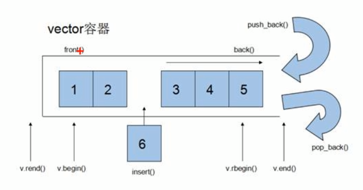
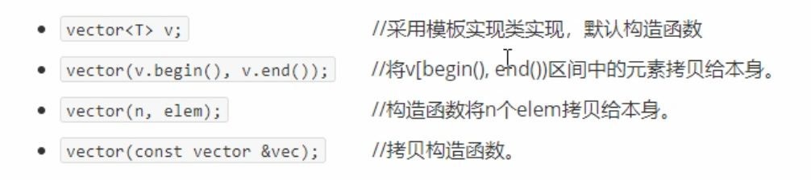

# 1 模板

## 1 概念

编程思想：==泛型编程==

模板是一个==通用摸具==，为了提高复用

C++中模板有两种：

+ 函数模板
+ 类模板

> + 模板是一个框架，不能直接使用
> + 模板通用性很高，但并非万能

## 2 函数模板

建立一个通用函数，函数的返回值类型和参数类型==可以先不具体指定==，用一个==虚拟类型==代替

### 1 语法

```c++
template <typename T>
函数的声明或定义
```

+ `template`：模板关键字，告诉编译器，下面是定义的模板
+ `typename T`：虚拟的数据类型，也就是通用数据类型，在对函数模板使用时，会使用具体数据类型实现该虚拟数据类型
  + `typename` 定义 `T` 为虚拟数据类型的关键字，也可以使用 `class`
  + `T`只是名字，可以替换成任意的合法命名

### 2 使用方法

1. 自动推导

   使用定义的模板函数时，直接输入参数对函数进行调用，编译器会==根据输入的参数自动推导虚拟数据类型`T`的实现==

   + 比如下面代码中 `a` 和 `b` 的类型会自动推导出为 `int` 类型

2. 显式指定类型

   + 语法：`函数模板名<具体数据类型>(参数列表)`
     + 尖括号中的**具体数据类型**会指定函数模板定义中的 `T` 为该数据类型

**代码**：

```c++
#include <iostream>
using namespace std;

template <typename T>
void mySwap(T &a, T &b){
    T temp = a;
    a = b;
    b = temp;
}

int main(){
    int a = 2, b = 20;
    // 自动类型推导
    swap(a, b);
    printf("%d\n",a);
    printf("%d", b);
    // 显式指定类型
    swap<int>(a, b);
    printf("%d\n",a);
    printf("%d", b);
    return 0;
}
```

### 3 注意事项

1. 函数模板在调用时，在使用自动类型推导时，需要保持 ==`T` 的数据类型一致性==
   1. 所以，在通过**自动类型推导**来调用函数模板时，和普通函数不一样的是，是不会发生**隐式数据类型转换**的

2. 函数模板在调用时，一定要==对 `T` 指定出具体的数据类型==
   1. 如果是自动类型推导，就需要保持 `T` 的数据类型的一致性
   1. 可以使用显式指定类型
   
3. 当函数模板中使用迭代器并声明迭代器对象时，由于编译器不知道对象名前面的是类型名还是迭代器容器中的属性，导致二义性错误而报错，比如：

   1. ```c++
      template<typename T>
      void printVectorTemplator(vector<T>& v) {
      	for ( vector<T>::iterator it = v.begin(); it != v.end(); ++it) { 
      		cout << *it << '\t';
      	}
      	cout << endl;
      }
      ```

      1. 报错行：`for ( vector<T>::iterator it = v.begin(); it != v.end(); ++it) { `

      2. 报错原因：编译器不知道 `vector<T>::iterator` 是类型名还是容器中的成员

      3. 解决方法：使用`typename` 对该类型名进行限定

         将源代码改为`for (typename vector<T>::iterator it = v.begin(); it != v.end(); ++it) {`


### 4 函数模板案例 - 不同数据类型数组排序

1. 利用函数模板封装一个排序的函数，可以对**不同数据类型**数组进行排序
2. 排序规则从大到小，排序算法为**选择排序**
3. 分别利用char数组和int数组进行测试

```c++
#include <iostream>
#include <utility>
using namespace std;

template <typename T>
void m_swap(T &a, T &b){
    T temp = a;
    a = b;
    b = temp;
}

template <typename T>
void m_sort(T a, int length){

    for(int i = 0; i!= length; ++i){
        int min = i;
        for(int j = i+1; j!= length; ++j){
            if(a[j] < a[min]) min = j;
        }
        m_swap(a[i], a[min]);
    }

}
int main(){
    int a[4] = {1,3,4,2};
    char b[4] = {'1','2', '3', '4'};
    
    // 自动类型推导
    m_sort(a, 4);
    for(int i= 0; i < 4; ++i){
        cout << a[i] << endl;
    }
    
	// 自动类型推导
    m_sort(b, 4);
    for(int i= 0; i < 4; ++i){
        cout << b[i] << endl;
    }
    return 0;
}
```

### 5 普通函数与函数模板的调用规则                                               

1. 当普通函数的函数名与函数模板中的函数名相同时
   1. ==代价最小原则==：
      1. **如果参数的数据类型符合普通函数的参数列表，优先调用普通函数**
      2. **否则，优先调用函数模板**
   2. 显式调用模板时，可以通过==空模板参数列表 `<>`== ，告诉编译器此处调用的是函数模板
2. 函数模板也可以发生==函数重载==

> 如果已经提供函数模板，建议不要再一个写同名的普通函数，容易出现二义性


### 6 函数模板的局限性

模板中的 `T` 虽然是通用数据类型，但是如果调用时，传入的数据类型是特殊的数据类型，比如自定义的数据类型，就会导致虽然数据类型可以成功传入，但是在程序运行时，运算符会限制住对传入数据类型的操作，比如两个类对象做 `a == b` 的计算，编译器就会不知道应该如何计算，会照成编译报错。


解决方法：

1. 对运算符的操作

   1. **对自定义的数据类型或者类做运算符重载**

2. 对模板的操作

   1. **对具体数据类型做具体化的实现**

      语法：

      ```c++

对具体数据类型做具体化的实现：

```c++
#include <iostream>
using namespace std;

class Person{
public:
    Person(int age, string name){
        m_age = age;
        m_name = name;
    }

    int m_age;
    string m_name;
};


template <typename T>
bool m_equal(T a, T b){
    if(a == b) return 1;
    else return 0;
}

template<>bool m_equal(Person a, Person b){
    if(a.m_age == b.m_age)return 1;
    else return 0;
}


void test(){
    int a = 0, b = 1;
    cout << m_equal(a, b) << endl;

    Person p(18, "张三");
    Person p1(20, "里斯");
    cout << m_equal(p, p1);
}

int main(){
    test();

    return 0;
}
```

## 3 类模板

### 1 语法：

```c++
template <typename T>
类
```

> 定义时语法和函数模板没啥区别

### 2 类模板使用时和函数模板的区别

1. 类模板没有自动类型推导，必须显式指定
2. 类模板的模板参数列表可以有默认值

### 3 类模板的成员函数

+ 普通类的成员函数在定义时创建
+ ==类模板的成员函数在**调用时**创建==

### 4 类模板对象做函数的参数

当类模板对象作为函数参数时，需要在传入参数时确定类模板对象中的成员属性的数据类型

有几种方式在传入参数时确定类模板对象成员属性的数据类型：

1. 直接将具体数据类型传入
2. 间接将具体数据类型传入——将具有类模板对象参数的函数转化为函数模板
   1. 将成员属性的数据类型作为模板参数
   2. 将对象对应的类作为模板参数

```c++
#include <iostream>
#include <string>
using namespace std;

template <class T1, class T2>
class Person{
public:
    Person(T1 age, T2 name){
        m_age = age;
        m_name = name;
    }

    T1 m_age;
    T2 m_name;
};

// 1. 指定参数类型传入
void printP1(Person<int, string> &p){
    cout << p.m_age << " : "  << typeid(p.m_age).name() << endl;
    cout <<  p.m_name << " : " << typeid(p.m_name).name() << endl;
}


void test1(){
    Person<int, string> p(18, "张三");
    printP1(p);
}

// 2. 函数模板化，传入的类的参数作为模板参数
template <typename T1, typename T2>
void printP2(Person<T1, T2> p){
    cout << p.m_age << " : "  << typeid(p.m_age).name() << endl;
    cout <<  p.m_name << " : " << typeid(p.m_name).name() << endl;
}

void test2(){
    Person<int, string> p(18, "张三");
    printP2(p);
}

// 3. 函数模板化，传入的类作为模板参数
template <class T>
void printP3(T p){
    cout << p.m_age << " : "  << typeid(p.m_age).name() << endl;
    cout <<  p.m_name << " : " << typeid(p.m_name).name() << endl;
}

void test3(){
    Person<int, string> p(18, "张三");
    printP3(p);
}

int main(){
    // test1();
    // test2();
    test3();

    return 0;
}
```

### 5 类模板的继承

和上述情况一样，同样需要指定父类中成员属性的具体数据类型

> 原因：类模板中成员属性的数据类型没有被指定，编译器无法为继承该类的子类分配内存

解决方法也同上：

1. 在继承时直接指定父类模板参数的具体类型
   1. 相当于在继承时将父类模板退化为普通的类
2. 将子类转化为模板，将父类的模板参数传递给子类

```c++
#include <iostream>
#include <string>
using namespace std;


template <class T1, class T2>
class Person{
public:
    Person(T1 age, T2 name){
        m_age = age;
        m_name = name;
    }

    T1 m_age;
    T2 m_name;
};

// 1. 指定参数类型传入
class SonOfPerson:public Person<int, string>{

};

// 2. 将子类转化为类模板
template <class T1, class T2, class T3>
class SonOfPerson2 : public Person<T1, T2>{
    public:
	T3 m_address;
};
/*
	可以看出上述代码中 T1, T2 是父类的模板参数传递给子类
	T3 是子类新加入的模板参数
*/


int main(){

    return 0;
}
```

### 6 类模板成员函数的类外实现

代码：

```c++
#include <iostream>
#include <string>
using namespace std;


template <class T1, class T2>
class Person{
public:
    Person(T1 age, T2 name);

    void printP();

    T1 m_age;
    T2 m_name;
};

// 1. 将成员函数转化为函数模板
template <class T1, class T2>
Person<T1, T2>::Person(T1 age, T2 name){ // 2. 添加类作用域，而且在类作用域后添加上参数列表
    this->m_age = age;
    this->m_name = name;
}

template <class T1, class T2>
void Person<T1, T2>::printP(){
    cout << "姓名" << this->m_name << endl;
    cout << "年龄" << this->m_age << endl;
}

void test(){
    Person<int, string> p(19, "张三");
    p.printP();
}

int main(){
    test();

    return 0;
}
```

> 实现重点：
>
> 1. 模板：
>    1. 类外实现类模板内的成员函数，首先需要==将成员函数转化为函数模板==
> 2. 作用域：
>    1. 类外实现类内成员函数需要==加上类的作用域==，指定这个函数是某个类内的成员函数
>    2. 当类是类模板时，需要在添加作用域时，==添加上模板参数==，指定这个函数所在的类是类模板
>       1. 参数列表和类模板的参数列表相同

### 7 类模板分文件编写

问题：==类模板中的成员函数在调用时创建，在文件链接时，链接不到==

解决方法：

1. 不再引入头文件，而是**直接引入实现了头文件的源文件** `*.cpp*`
2. **将头文件和实现写入到同一个文件当中**，并将文件后缀写为`*.hpp*`
   1. 这个后缀只是一种约定，写成`*.cpp`也无所谓，但写成这样是为了告诉浏览器，这个是关于类模板的一个定义实现文件

#### 第一种解决方法代码：

`Person.c`

```c++
#include <iostream>
#include <string>
using namespace std;

// Person 类模板定义
template <class T1, class T2>
class Person{
public:
    Person(T1 age, T2 name);

    void printP();

    T1 m_age;
    T2 m_name;
};
```


`Person.cpp`

```c++
#pragma once 
#include "Person.h"


// Person 类模板的类外实现
template <class T1, class T2>
Person<T1, T2>::Person(T1 age, T2 name){
    this->m_age = age;
    this->m_name = name;
}

template <class T1, class T2>
void Person<T1, T2>::printP(){
    cout << "姓名" << this->m_name << endl;
    cout << "年龄" << this->m_age << endl;
}

```


`main.cpp`

```c++
#include <iostream>
#include <string>
using namespace std;
#include "Person.cpp" // 直接引入实现后的源文件

void test(){
    Person<int, string> p(19, "张三");
    p.printP();
}

int main(){
    test();

    return 0;
}
```

#### 第二种解决方法代码：

`Person.hpp`

将类模板定义和类模板的实现放到同一个`hpp`文件中

```c++
#include <iostream>
#include <string>
using namespace std;

// Person 类模板定义
template <class T1, class T2>
class Person{
public:
    Person(T1 age, T2 name);

    void printP();

    T1 m_age;
    T2 m_name;
};

// Person 类模板的类外实现
template <class T1, class T2>
Person<T1, T2>::Person(T1 age, T2 name){
    this->m_age = age;
    this->m_name = name;
}

template <class T1, class T2>
void Person<T1, T2>::printP(){
    cout << "姓名" << this->m_name << endl;
    cout << "年龄" << this->m_age << endl;
}
```

`main.cpp`

```c++
#include <iostream>
#include <string>
using namespace std;
#include "Person.hpp" // 引入 hpp 文件

void test(){
    Person<int, string> p(19, "张三");
    p.printP();
}

int main(){
    test();

    return 0;
}
```

### 8 类模板与友元函数

> 首先，回忆一下**友元函数**：
>
> ​		在类的开始，使用`friend`关键字声明的函数，是该类的友元函数，这个函数可以访问该类中的私有属性
>
> 
>
> 然后，回忆一下友元函数实现的细节：
>
> 1. 在定义友元函数时，首先需要在类中声明该友元函数，也就是说，该函数的实现应先于该类的实现
>    1. 全局函数之所以不在意这个，是因为全局函数存储在全局区，是在函数编译时，首先被编译的
> 2. 友元函数需要访问该类，也就是说，友元函数的实现应该在类的声明之后


类模板使用友元函数又根据友元函数的实现方式分为两种：

1. 友元函数在类模板类内实现
2. 友元函数在类模板类外实现

#### 第一种：友元函数类内实现

这种情况就很简单，直接写就OK

```c++
#include <string>
#include <iostream>
using namespace std;

// Person 类模板定义
template <class T1, class T2>
class Person{
    // 友元函数应该是个函数模板，因为Person 类是一个类模板，如果友元函数不是函数模板，则无法与类模板传入的参数类型保持一致
    friend void printPerson(Person<T1, T2> &p){
    cout << p.m_age << endl;
    cout << p.m_name << endl;
}
public:
    Person(T1 age, T2 name);

    void printP();
private:
    T1 m_age;
    T2 m_name;
};

// Person 类模板的类外实现
template <class T1, class T2>
Person<T1, T2>::Person(T1 age, T2 name){
    this->m_age = age;
    this->m_name = name;
}


void test(){
    Person<int, string> p(19, "张三");
    printPerson(p);
}

int main(){
    test();

    return 0;
}
```


#### 第二种：友元函数类外实现

1. 类声明在最开始
2. 友元函数定义
3. 类定义，类内的友元函数的声明也在这一步写

或者更复杂一些：

1. 类声明
2. 友元函数的函数声明
3. 类定义，友元声明
4. 友元函数定义

```c++
#include <string>
#include <iostream>
using namespace std;

// 类模板声明
template <class T1, class T2>
class Person;

// 友元函数的类外实现
// 友元函数的声明应该在类模板完整定义之前
// 由于友元函数的参数为类模板对象，所以其声明也应该在类模板声明之后
template <class T1, class T2>
void printPerson(Person<T1, T2> &p){
    cout << p.m_age << endl;
    cout << p.m_name << endl;
}

// Person 类模板定义
template <class T1, class T2>
class Person{
    // 友元函数声明
    friend void printPerson<>(Person<T1, T2> &p);
public:
    Person(T1 age, T2 name);

    void printP();
private:
    T1 m_age;
    T2 m_name;
};

// Person 类模板的类外实现
template <class T1, class T2>
Person<T1, T2>::Person(T1 age, T2 name){
    this->m_age = age;
    this->m_name = name;
}


void test(){
    Person<int, string> p(19, "张三");
    printPerson(p);
}

int main(){
    test();

    return 0;
}
```

## 4 案例 - 通用数组

`MyArray.hpp`

```c++
#pragma once
#include <string>
#include <iostream>
using namespace std;

/*
1. 构造函数和析构函数不是程序员能够主动调用的函数，而是在对象创建和生命周期结束时，会被编译器主动调用
2. 需要做什么功能时，需要提前将功能的流程给计划好

*/
template <class T>
class MyArray{
public:
    MyArray<T>(int num);// 构造函数
    MyArray<T>(MyArray<T> &array);
    ~MyArray<T>();
public:
    // 尾插法
    void RearInsert(T value);
    // 尾删法
    void RearDelete();
    // 重写 = 运算符，防止浅拷贝问题
    MyArray<T>& operator=(const MyArray<T> &array);
    // 重写 [] 运算符，根据下标获取数据
    T& operator[](int num);

    // 获取当前元素个数
    int getCounts();
    // 获取当前数组长度;
    int getLength();
private:
    T* m_value;// 数组
    int m_length;// 数组长度
    int m_counts;// 当前元素个数
};

// 有参构造
template <class T>
MyArray<T>::MyArray(int num){
    cout << "调用有参构造" << endl;
    this->m_value = new T[num];
    this->m_length = num;
    this->m_counts = 0;
}
// 拷贝构造
template <class T>
MyArray<T>::MyArray(MyArray &array){
    cout << "调用拷贝构造" << endl;
    this->m_length = array.m_length;
    this->m_value = new T[array.m_length];
    for(int i = 0; i != array.m_counts; ++i){
        this->m_value[i] = array.m_value[i];
    }
    this->m_counts = array.m_counts;
    
}

// 尾插法
template <class T>
void MyArray<T>::RearInsert(T value){
    if (this->m_counts >= this->m_length) {
        return;
    }else {
        this->m_value[this->m_counts++] = value;
    }
}

// 尾删法
template <class T>
void MyArray<T>::RearDelete(){
    if(this->m_counts == 0){
        cout << "数组中没有数据, 删除失败" << endl;
        return;
    }
    --this->m_counts;
}

// 重写 = 运算符，防止浅拷贝
template <class T>
MyArray<T>& MyArray<T>::operator=(const MyArray<T> &array){
    // 判断当前类是否有数据
    if(this->m_counts != 0){
        // 初始化
        delete [] this->m_value;
        this->m_value = NULL;
        this->m_counts = 0;
         this->m_length = 0;
    }

    this->m_length = array.m_length;
    this->m_value = new T[this->m_length];
    for(int i = 0; i != array.m_counts; ++i){
        this->m_value[i] = array.m_value[i];
    }
    this->m_counts = array.m_counts;
    return *this;
}

// 获取当前元素个数
template <class T>
inline int MyArray<T>::getCounts(){
    return this->m_counts;
}

// 获取当前数组长度
template <class T>
inline int MyArray<T>::getLength(){
    return this->m_length;
}

    // 析构
    template <class T>
    MyArray<T>::~MyArray<T>(){
        if(this->m_value!=NULL){
            for(int i = 0; i != m_counts; ++i){
                delete this->m_value[i];
            }
        }
        delete [] this->m_value;
        this->m_value = NULL;
    }

template <class T>
T& MyArray<T>::operator[](int num){
    return this->m_value[num];
}
```

`main.cpp`

```c++
#include <string>
#include <iostream>
#include "MyArray.hpp"
using namespace std;

class Person{
    
    public:
    Person(int age, string name);
    int age;
    string name;
};

Person::Person(int age, string name){
    this->age = age;
    this->name = name;
}

int main(){
    Person* p1 = new Person(18, "张三");
    Person* p2 = new Person(19, "张三哥哥");
    Person* p3 = new Person(20, "藏三");

    MyArray<Person*> array(3);
    array.RearInsert(p1);
    array.RearInsert(p2);
    cout << array[1]->age << endl;
    return 0;
}
```

# 2 STL 初识

## 1 STL概念

**STL(Standard Template Library)** 标准模板库

大概组成：

1. **容器（container）**
2. **算法(algorithm)**
3. **迭代器(iterator)**

**容器**和**算法**之间用**迭代器**进行连接

## 2 六大组件

1 容器：各种数据结构

2 算法：常用算法

3 迭代器：容器算法之间的胶合剂

4 仿函数：行为类似函数，作为算法的某种策略

​	重载 () 运算符后，使得类的行为类似于函数

5 适配器：用来修饰容器、仿函数或迭代器接口

6 空间配置器：对空间的配置和管理

## 3 容器

常用的数据结构：数组、树、链表、映射表、栈、队列、集合等

分类：

1. 关联式容器：二叉树结构，数据之间没有严格的物理关系
2. 序列式容器：强调数据的顺序，容器中每一个值都有**固定**的位置

## 4 算法

分类：

1. 质变算法：涉及到对数据修改操作的算法
2. 非质变算法：查找，排序等不涉及对数据修改操作的算法

## 5 迭代器

容器和算法之间的桥梁，用于访问容器中的数据且不暴露容器的内部表示

每一种容器都有其专有的迭代器

使用方式类似于指针

常用迭代器有五种：

1. 输入迭代器
2. 输出迭代器
3. 正向迭代器：
   1. 只支持向前遍历，也就是`++`操作，也支持`*p`
      1. 也就是上文说的，使用方式类似于指针，甚至可以直接当作指针来看待
   2. 在正向迭代器之间支持`==` 与 `!=` 逻辑运算
4. 双向迭代器
   1. 拥有正向迭代器的全部功能，而且支持向后遍历，也就是`--`操作
5. 随机访问迭代器
   1. 支持双向迭代器的全部功能的同时，支持随机访问，也就是`p+i`、`p-i`的操作
   2. 在随机访问迭代器之间支持`>`、`>=`、`<`、`<=`、`==`、`!=`逻辑运算 

# 3 常用容器

## 1 String 容器

> 与 C 语言中的字符串 `char*` 的区别：
>
> + C 语言中的 `char*` 本质上是一个字符数组，或者说是一个指针
>
> + string 的本质是一个类，类中维护着 `char*`，是一个`char*`的容器

### 1 构造函数

1. 无参构造`string();`
   1.  返回一个空字符对象
2. 有参构造`string(const char* s);`
   1. 参数为字符串`s` 
3. 拷贝构造，`string(const string& s);`
4. 有参构造，`string(int n, char c)`
   1. 使用 n 个字符 `c`组成字符串

### 2 赋值


> 前三个是对运算符 `=` 的重写，后四个是成员函数
>
> 这些函数的作用是为了防止浅拷贝

### 3 `string` 字符串拼接

在字符串的末尾追加字符


### 4 `string` 字符串的查找和替换


find

`int position = str1.find(str2, pos=0, )`

在 `str1` 中查询 `str2` 的起始位置下标，如果不存在返回 `-1`

`rfind` 是从右往左找—— `rfind` —— `reverse find`


replace

`int str2 = str2.replace(pos, n, str1)`

`str2` 中的字符，从`pos` 开始的 `n` 个字符替换成`str1`

1. 替换前和替换后 `str2` 的地址保持不变，也就是说，替换的操作是在 `str2` 本身上进行的。
2. 替换操作并不是按字符单位来进行的，而是子串替换
   1. 也就是说，无论 `n`多大，都会将`str1`替换掉`[pos, pos+n-1]`的字符


### 5 字符串的比较


比较方式：==根据字符串的 ASCII 值进行比较==

`str1.compare(str2)`

+ `0`：当 `str1 == str2` 返回值为 `0`
+ `1` ：当 `str1 > str2` 返回值为 `1`
+ `-1`：当`str1 < str2` 返回值为 `-1`


### 6 字符存取

从 `string` 中访问单个字符的方式有两种：

1. 通过 `[]` 运算符：`char& oprator[](int n);`
2. 通过`at` 方法：`char& at(int n);`

> 也能通过上述两种方式对字符串进行修改

### 7 字符串插入与删除


### 8 string 字串

从 string 对象中获取字符串子串


## 2 vector 容器

<<<<<<< HEAD


=======
>>>>>>> de013e649d3bbde8930a540aea57007a058fa657
1. 和数组十分相似，被称为**单端数组**
   1. 单端数组的原因是：vector只能在数组末端进行插入删除的操作

2. 可以**动态扩展**
3. 其迭代器是支持随机访问的迭代器

> vector 容器的动态扩展：
>
> 1. 并不是在原空间后接入新空间，而是，重新寻找一个更大的内存空间，将原内存中的数据复制到新内存空间中，并释放原空间
>
> 2. **找到的新空间的内存大小往往是原空间的 `2` 倍**

### 1 构造函数

四种构造方法：

+ 默认无参构造
+ 区间构造
  + `vector(v.begin(), v.end())`
  + 前闭后开，`[v.begin(), v.end())`
+ n个elem
+ 拷贝构造


```c++
#include <string>
#include <iostream>
using namespace std;
#include <vector>

template <typename T>
void printVector(vector<T> v){
    for(typename vector<T>::iterator it = v.begin(); it!=v.end(); ++it){
        cout << *it << "\t";
    }
    cout << endl;
}

int main(){

    // 通过默认构造函数
    vector<int> v1;
    for(int i = 0; i < 10; ++i){
        v1.push_back(i);
    }
    printVector(v1);

    // 通过区间
    vector<int> v2(v1.begin(), v1.end());
    printVector(v2);

    // n 个 elem
    vector<int> v3(10, 100);
    printVector(v3);

    // 拷贝构造函数
    vector<int> v4(v3);
    printVector(v4);
    
    return 0;
}
```

> ```c++
>  for(typename vector<T>::iterator it = v.begin(); it!=v.end(); ++it)
> ```
>
> 注意上一行代码，其中**关键字 `typename` 是必不可少的**
>
> **原因**：
>
> ​	`vector<T>::iterator` 编译器无法确定这个是类型还是容器成员变量，二义性错误
>
> **解决方案**：
>
> 1. 添加关键字 `typename` 告诉编译器，这个是类型
>
> 2. 将函数模板修改成普通函数
>
>    如下行代码，直接将`int`类型注入，这行代码是不会报错的
>
>    ```c++
>    for(vector<int>::iterator it = v.begin(); it!=v.end(); ++it)
>    ```

### 2 赋值操作

两种方式：

1. 赋值运算符`=`重载

   `v2 = v1`

2. `assign`方法

   1. 通过区间——左闭右开

      `v3.assign(InputIterator first, InputIterator last);`

   2. n 个 elem

      `v4.assign(size_type n, const value_type &val);`


```c++
#include <string>
#include <iostream>
using namespace std;
#include <vector>

template <typename T>
void printVector(vector<T> v){
    for(typename vector<T>::iterator it = v.begin(); it!=v.end(); ++it){
        cout << *it << "\t";
    }
    cout << endl;
}

int main(){

    vector<int> v1;
    for(int i = 0; i < 10; ++i){
        v1.push_back(i);
    }
    printVector<int>(v1);

    // 1 通过赋值运算符重写
    vector<int> v2;
    v2 = v1;
    printVector<int>(v2);

    // 2 通过 assign 方法 
    
    // 2.1 区间
    vector<int> v3;
    v3.assign(v1.begin(), v1.end());
    printVector<int>(v3);

    // 2.2 n 个 elem
    vector<int> v4;
    v4.assign(10, 100);
    printVector<int>(v4);
    
    return 0;
}
```

### 3 容量和大小

容量：容器所能容纳元素的个数

大小：容器中当前已有元素的个数


`vector` 容器提供了关于容器容量和大小的接口：

+ `ivec.empty()`

  + 判断容器是否为空

+ `ivec.capacity()`

  + 返回容器所能容纳的元素的个数

  + 同时也代表着当前容器所占内存空间的大小为 `ivec.capacity() * sizeof(type)`

    > 如果没有设置预分配空间大小，则下次预分配空间大小为 `ivec.capacity()`

+ `ivec.size()`

  + 返回容器中当前已有元素个数

  + `ivec.size() <= ivec.capacity()`

    > 关于容器收缩空间，则往往是指使容器容量收缩为当前容器所拥有元素大小，也即使 `ivec.capacity() == ivec.size()`
    >
    > 方法有多种，这里举出两种：
    >
    > 1. 使用`shrink_to_fit()` 函数，请求回收内存空间
    > 2. 使用 `sway()` 函数和匿名对象，进行内存空间的收缩

+ `resize(int num, elem=default)`

  + 重设容器所能容纳元素的大小

  	> 注意，`resize(num)` 函数是重新改变容器所能容纳元素的个数为 `num`，也是就说，对于不同大小的 `num`，将有不同的几种情况：(令当前的`ivec.size()` 为 `n`， 而当前的 `ivec.capacity` 为 `m`，`n<=m`)
  	>
  	> 1. `num < n`
  	>    + `ivec.size() == num`，但`ivec.capacity()`大小不变
  	>    + 相当于从当前容器`ivec`中截留了`num`个元素
  	>    + 也就是， 保留了当前容器`ivec`中的`[0, num)`对应下标的元素，而将`[num, ivec.size())`对应下标的元素给删除掉了 
  	> 2. `num == n`
  	>    + `ivec.size()`和`ivec.capacity()`大小都不变
  	>    + 相当于代码不生效
  	> 3. `n < num < m`
  	>    + `ivec.size() == num`，但`ivec.capacity()`大小不变
  	>    + 且，由于`n < num`，所以需要使用填充元素使当前已有元素个数达到`num`个
  	> 4. `num == m`
  	>    + 同上，只不过将`size` 的大小，填充至和`capacity`的大小相等
  	> 5. `m < num `
  	>    + 首先，`ivec`需要**重新分配内存空间**
  	>    + 重新分配的内存空间大小将以`m`为基数，以`2`为系数倍增，直到`ivec.capacity() >= num`
  	>      + 如果使用`reserve(int num1)`函数设置了预分配空间大小，则在分配内存空间时，将以`num1`和`m`中较大的值为基数
  	>    + 其次，容器中将填充元素使`ivec.size() == num`

+ `reserve(int num)`

  + 重设容器预分配空间大小

  + 用于减少重新分配内存空间的次数

    > 有两种情况：
    >
    > 1. `num <= ivec.capacity()` 
    >    + 该函数不起任何作用
    > 2. `num > ivec.capacity()`
    >    + `ivec`**重新分配内存空间**，以使得`ivec.capacity() == num`

+ `shrink_to_fit()`

  + 请求回收内存空间:，注意是请求，也就是说，这一条代码不一定生效


### 4 数据访问

1. 使用容器**迭代器**
2. 使用 `at(int index)` 方法
3. 使用` []` 运算符
4. 特殊：
   1. 使用`front()` 方法获取容器中第一个元素
   2. 使用`back()` 方法获取容器中最后一个元素

### 5 容器互换

`vector`提供`swap()`接口，使得两容器中的元素可以互换

> 特殊用途：收缩内存
>
> ```c++
> vector<int>(v1).swap(v1);
> ```
>
> 上述代码为使用`sway()`进行内存收缩的核心代码，可以分解为如下几步
>
> 1. 使用拷贝构造创建匿名对象 `vector<int>(v1)`，假设匿名对象为 `v2`
>    1. `v2.capacity() == v1.size()`
> 2. 交换内存空间 `v2.sway(v1)`
>    1. `v1.capacity() == v2.capacity() == v1.size()`
> 3. 编译器释放匿名对象
>    1. 匿名对象在该行代码执行完毕后，会被编译器自动释放掉内存空间

测试完整代码：

```c++
#include <string>
#include <iostream>
using namespace std;
#include <vector>

template <typename T>
void printVector(vector<T> v){
    for(typename vector<T>::iterator it = v.begin(); it!=v.end(); ++it){
        cout << *it << "\t";
    }
    cout << endl;
}

int main(){

    vector<int> v1;
    for(int i = 0; i < 10; ++i){
        v1.push_back(i);
    }
    printVector<int>(v1);
    cout << v1.capacity() << endl; // 16
    cout << v1.size() << endl; // 10
    cout << &v1[0]<<endl;
    cout << endl;

    v1.reserve(20);

    printVector<int>(v1);
    cout << v1.capacity() << endl; // 20
    cout << v1.size() << endl; // 10
    cout << &v1[0]<<endl;
    cout << endl;


    // 使用 shrink_to_fit() 进行内存的收缩
    // v1.shrink_to_fit();

    // printVector<int>(v1);
    // cout << v1.capacity() << endl;
    // cout << v1.size() << endl;
    // cout << &v1[0]<<endl;
    // cout << endl;

    // 使用 sway 进行内存收缩
    vector<int>(v1).swap(v1);

    printVector<int>(v1);
    cout << v1.capacity() << endl; // 10
    cout << v1.size() << endl; // 10
    cout << &v1[0]<<endl;
    cout << endl;
    
    return 0;
}
```

### 6 预留空间

使用`reserve()`函数，设置容器预留空间

> **如何统计`vector`容器扩展的次数?**
>
> 根据容器首地址改变的次数来进行统计
>
> ```c++
> #include <string>
> #include <iostream>
> using namespace std;
> #include <vector>
> 
> int main(){
> 
>     vector<int> v1;
>     int *p = NULL;
>     int num = 0;
>     for(int i = 0; i < 10000; ++i){
>         v1.push_back(i);
>         if(p != &v1[0]){
>             p = &v1[0];
>             ++num;
>         }
>     }
>     cout << num << endl; // 15
>     return 0;
> }
> ```

## 3 deque 容器

双端数组，可以在头部和尾部都进行插入和删除

> 如果是 `vector` 容器进行在头部的插入操作，就需要重新开辟空间；同时，对于 `vector` 容器，删除操作无论开不开辟新的空间，都将会是一个$\Omicron(n) $级别的操作。
>
> 所以：
>
> 1. 如果是需要进行在头部的插入删除操作，`deque`是比`vector`更优选的操作
> 2. `vector` 访问元素的速度要快于 `deque`，这是因为二者的内部实现不同


> 提供的接口和 vector 基本一致，唯一区别是`deque`可以进行头部的插入删除

### 1 构造函数

> 和 vector 构造方式一样

```c++
// 静态迭代器
// 如果在函数入口处用 `const` 关键字限定容器不可以修改，那么使用的容器的迭代器也应该是 `const` 版
// 因为可以简单把迭代器当作容器的指针，那就很显然了，如果使用正常的迭代器类型区遍历`const`类型容器，显然会存在一个类型不符的错误
// 必须要记得， const 是可以作为函数重载的条件的
#include <iostream>
#include <deque>
using namespace std;

template <typename T>
void printDeque(const deque<T> &d1){
    // 注意！下一行代码中的 it 的类型 不再是 typename deque<T>::iterator
    // 而是 typename deque<T>::const_iterator 静态迭代器
    for(typename deque<T>::const_iterator it = d1.begin(); it != d1.end(); ++it){
        cout << *it << "\t";
    }
    cout << endl;
}

void test1(){
    deque<int> d1;
    for(int i = 0; i < 10; ++i){
        d1.push_back(i);
    }
    printDeque(d1);
}

int main(){
    test1();
    return 0;
}
```

### 2 赋值


> 和 vector 容器基本一样

### 3 deque 容器大小


> + 和 vector 操作几乎一样，区别是 deque 容器没有容量的概念
> + 一共三种操作：
>   + 判空 `empty`
>   + 返回大小 `size`
>   + 改变大小 `resize`

### 4 插入删除


> 上述所有操作中的位置是迭代器

### 5 数据存取

> 和 vector 操作一样

1. 迭代器
2. 操作符`[]`的重载
3. `at` 函数
4. 两个特殊接口：
   1. `front()`
   2. `back()`

### 6 排序

使用 `STL algorithm`中的 `sort` 函数


```c++
#include <iostream>
#include <deque>
#include <algorithm>
using namespace std;

template <typename T>
void printDeque(const deque<T> &d1){
    for(typename deque<T>::const_iterator it = d1.begin(); it != d1.end(); ++it){
        cout << *it << "\t";
    }
    cout << endl;
}

void test1(){
    deque<int> d1;
    d1.push_back(1);
    d1.push_back(2);
    d1.push_back(3);
    d1.push_front(100);
    d1.push_front(200);
    d1.push_front(300);
    printDeque(d1); // 300 200 100 1 2 3

    //排序 需要包含头文件 <algorithm>
    // sort(ideque.begin(), ideque.end());
    // 默认是从小到大排序
    sort(d1.begin(), d1.end());

    printDeque(d1); // 1       2       3       100     200     300
}

int main(){
    test1();
    return 0;
}
```

> 支持随机访问迭代器的容器都可以使用这个 `sort` 函数进行排序，比如 `vector`
>
> 补充：==所有不支持随机访问迭代器的容器，都不可以使用标准算法==

## 4 案例-评委打分


解决思路：

1. 针对于每一个选手的分数
   1. 将每个人的分数存放在 deque中
   2. 排序
   3. 计算从第二个到倒数第二个之间分数的平均分
2. 针对五名选手
   1. 创建 Person 类
      1. 姓名
      2. 分数
   2. 将五名选手存储在 Vector 容器中

```c++
#include <crtdefs.h>
#include <iostream>
#include <deque>
#include <algorithm>
#include <stdlib.h>
#include <vector>
using namespace std;

class Person{
    public:
    Person(string s){
        this->m_name = s;
        this->m_score = -1; // 初始为 -1
    }

    string m_name;
    int m_score;
};

template <typename T>
void printDeque(const deque<T> &d1){
    for(typename deque<T>::const_iterator it = d1.begin(); it != d1.end(); ++it){
        cout << *it << "\t";
    }
    cout << endl;
}

void printVector(const vector<Person> &d1){
    for(typename vector<Person>::const_iterator it = d1.begin(); it != d1.end(); ++it){
        cout << it->m_name << " : " << it->m_score << " \t";
    }
    cout << endl;
}

void test1(){
    vector<Person> v1;

    Person p1("李一");
    Person p2("李二");
    Person p3("李三");
    Person p4("李四");
    Person p5("李五");

    v1.push_back(p1);
    v1.push_back(p2);
    v1.push_back(p3);
    v1.push_back(p4);
    v1.push_back(p5);
    unsigned seed = time_t();
    srand(seed);
    for(int i =0; i!=5; ++i){
        deque<int> d1;
        for(int j = 0; j!= 10; ++j){
            int a = rand()%11;
            d1.push_back(a);
        }
        sort(d1.begin(), d1.end());
        int sumd = 0;
        for(deque<int>::iterator it = d1.begin()+1; it != d1.end()-1; ++it){
            sumd += *it;
        }
        
        v1[i].m_score = sumd/8;
    }
    printVector(v1);
}

int main(){
    test1();
    return 0;
}
```

> 缺点：没有模块化编程

## 5 stack 容器

对数据结构中的栈的实现

1. 不允许遍历， 只有栈顶元素可以被访问
2. 先进后出


## 6 queue 容器

对数据结构中的队列的实现

1. 同样不允许遍历
2. 先进先出
3. 不提供迭代器，不支持随机访问


## 7 list 容器

list是一个双向循环链表

> 对数据结构上链表的实现


链表不是连续的存储空间，所以链表的迭代器是双向迭代器，支持向前遍历和向后遍历，但不支持随机访问


链表的优点：

+ 内存是动态存储分配，不会造成内存溢出和内存泄漏
+ 插入删除操作是时间复杂度为1的操作，只需要修改对应节点指针

缺点：

+ 不支持随机访问，遍历需要挨个元素遍历
+ 需要额外存储指针，空间消耗相对较大


### 1 构造函数


> 与其他 STL 容器， 比如 vector 容器的构造方法一样

### 2 赋值操作和交换


> 和 vector 容器一样
>

swap 接口的两种调用方法：

1. `L1.swap(L2)`
2. `swap(L1, L2)`

### 3 大小


### 4 插入删除


`remove(elem)` 会删除容器中所有与 `elem` 值匹配的元素

### 5 数据存取

由于链表不是存储内存不连续，所以无法通过运算符`[]` 或者是 `at`方法访问其元素

只能通过双向迭代器，或者是指针逐个遍历，或者是`list`容器提供的接口：

+ `front()`
+ `back()`

### 6 翻转和排序

+ `reserve()` 翻转链表
+ `sort()` 链表排序

#### sort 函数

是 list 容器中的成员函数，默认是升序排序，可以提供比较器的方式，修改排序为降序

```c++
#include <crtdefs.h>
#include <iostream>
#include <deque>
#include <algorithm>
#include <list>
#include <stdlib.h>
#include <vector>
using namespace std;

class Person{
    public:
    Person(string s){
        this->m_name = s;
        this->m_score = -1; // 初始为 -1
    }
    Person(string s, int score){
        this->m_name = s;
        this->m_score = score; 
    }

    string m_name;
    int m_score;
};

void printList(const list<Person> &d1){
    for(typename list<Person>::const_iterator it = d1.begin(); it != d1.end(); ++it){
        cout << it->m_name << " : " << it->m_score << " \t";
    }
    cout << endl;
}

bool myCompara(Person &p1, Person &p2){

    return p1.m_score > p2.m_score;

}

void test1(){
    list<Person> l1;

    Person p1("李一", 12);
    Person p2("李二", 52);
    Person p3("李三", 21);
    Person p4("李四", 64);
    Person p5("李五", 19);

    l1.push_back(p1);
    l1.push_back(p2);
    l1.push_back(p3);
    l1.push_back(p4);
    l1.push_back(p5);

    printList(l1);
    l1.sort(myCompara);
    printList(l1);
}

int main(){
    test1();
    return 0;
}
```


> 1. 比较器其实就是比较规则，比如
>
>    ```c++
>    bool myCompare(int a, int b){
>        return a>b;
>    }
>    ```
>
>    上述代码就很明显，如果`a>b`，则返回真，否则返回假
>
>    这个比较器提供的比较规则就是前面的数据要大于后面的数据，换而言之，这个排序应该是降序排序
>
> 2. 如果列表中存储的是自定义数据类型，同样可以通过提供比较器的方式进行排序，比如上述的代码：
>
>    ```c++
>    bool myCompara(Person &p1, Person &p2){
>        return p1.m_score > p2.m_score;
>    }
>    ```
>
>    ==对于自定义数据类型的列表，则必须要提供比较器，否则会报错==
>
> 3. 通过比较器可以提供更为复杂的规则，比如
>
>    ```c++
>    bool myCompara(Person &p1, Person &p2){
>        // 先按照分数进行降序排序，再按照年龄升序排序
>        if(p1.m_score == p2.m_score){
>            return p1.m_age < p2.m_age;
>        }
>        return p1.m_score > p2.m_score;
>    
>    }
>    ```
>    
> 4. 这里是 list 容器中的 sort 函数，这个函数的参数
>

## 8 set/multiset 容器

特点：数据插入时，就会自动排序

本质：==set 和 multiset 是**关联式容器**，底层是**二叉树**==

区别：

+ set 不允许有重复数据
+ multiset 允许有重复数据

### 1 构造函数和赋值方式

#### 1 构造函数

set 容器存在两种构造方法：

1. 默认的无参构造
2. 拷贝构造

`set<typename Key, typename Compare, typename Alloc> s1;`

+ key 是 set 容器的数据类型
+ compare 是 set 容器的比较器，默认是 less

#### 2 set 容器的赋值方式

使用 set 容器中重载的`=`运算符进行赋值

```c++
set<int> s1;
s1.insert(3);
s1.insert(4);
s1.insert(1);
s1.insert(2);
s1.insert(4);
s1.insert(4);

// 1. set 容器中插入数据，会在插入时排序
// 2. set 容器不允许有重复的值，所以后面两个 4 的 insert 被忽略
printSet(s1); // 1 2 3 4

set<int> s2 = s1; // 使用 = 赋值

set<int>s3(s1); // 拷贝构造
```

### 2 大小和交换


### 3 插入和删除


> 在 set 容器中，由于插入数据时，数据会自动排序，所以插入数据的顺序是没有太大意义的(插入时不删除)，使用 `erase` 函数根据 `pos` 删除数据时，还是根据排好序之后的顺序进行删除，比如 `erase(s1.begin())` 一定是删除最小的元素

### 4 查找和统计


> 对于 set 容器而言，由于不允许重复数据，`count(key)` 的结果是 0 或者是 1

### 5 set 和 multiset 的区别

+ set 不允许插入重复的值
+ multiset 允许插入重复的值

#### 1 set 容器的 insert 函数

```c++
#if __cplusplus >= 201103L
      std::pair<iterator, bool> 
      insert(value_type&& __x)
      {
	std::pair<typename _Rep_type::iterator, bool> __p =
	  _M_t._M_insert_unique(std::move(__x));
	return std::pair<iterator, bool>(__p.first, __p.second);
      }
#endif
```

> 上述代码中可以看到： 
>
> 1. insert 函数的返回值为 `pair<iterator, bool>`
>
>    1. 第一个 iterator 返回的是插入数据的位置，也就是指向插入数据的迭代器
>    2. `bool `返回的是插入的数据是否重复，如果重复就插入失败
>
> 2. set 容器的 insert 函数的本质是调用 `_M_t._M_insert_unique(std::move(__x));`
>
>    唯一值插入

#### 2 multiset 容器的 insert 函数

```c++
#if __cplusplus >= 201103L
      iterator
      insert(value_type&& __x)
      { return _M_t._M_insert_equal(std::move(__x)); }
#endif
```

> 返回值是指向插入数据的迭代器，说明这里的插入函数没有进行重复值检查


#### 3 验证实验：

```c++
#include <crtdefs.h>
#include <iostream>
#include <algorithm>
#include <stdlib.h>
#include <set>
using namespace std;

void printList(const set<int> &d1){
    for(typename set<int>::const_iterator it = d1.begin(); it != d1.end(); ++it){
        cout << *it << "\t";
    }
    cout << endl;
}

void test1(){
    set<int> s1;

    std::pair<set<int>::iterator, bool> ret = s1.insert(10);
    if(ret.second == 1){
        cout << "插入成功：" << *(ret.first) << endl;
    }else{
        cout << "插入失败" << endl;
    }

    ret = s1.insert(10);
    if(ret.second == 1){
        cout << "插入成功：" << *(ret.first) << endl;
    }else{
        cout << "插入失败" << endl;
    }

    multiset<int> s2;

    multiset<int>::iterator it = s2.insert(10);

    cout << "插入数据为：" << *it << endl;
    
}

int main(){
    test1();
    return 0;
}
```

### 6 pair 对组的创建和使用

#### 1 创建


> 1. 默认有参构造
> 2. 使用 `make_pair` 方法

#### 2 使用

1. `s1.first()` 获取对组的第一个数据
2. `s1.second()` 获取对组的第二个数据

```c++
#include <iostream>
#include <string>
#include <utility>
using namespace std;


void printPair(pair<string, int> &p){
    cout << "姓名：" << p.first << "\t年龄：" << p.second << endl; 
}
void test1(){
    
    pair<string, int> p1;
    p1 = {"张三", 19};
    printPair(p1);

    pair<string, int> p2("李四", 18);
    printPair(p2);

    pair<string, int> p3 = make_pair("王五", 20);
    printPair(p3);
}

int main(){
    test1();
    return 0;
}
```

### 7 set 比较器

set 模板的模板参数有三个：

```c++
set<typename Key, typename Compare, typename Alloc>
```


如上图所示：

1. 声明的 set 容器的数据类型 `key`
2. 比较器 `Compare`，默认值为 `less`
3. `Alloc `是 set 容器的分配器


比较器的功能为设置排序规则，主要体现在两方面：

1. 设置排序的规则
2. 设置排序的数据

> 1. 针对于第一条，体现在我们可以使 set 容器的数据从升序改为降序
> 2. 针对于第二条，体现在对于结构化数据，我们可以选择其中某一些数据作为排序数据
> 3. 第一条和第二条结合，可以使排序规则更多样，比如设置针对于哪一种数据作为第一排序数据，排序方式为升序或是降序，设置哪一个数据为第二排序数据，排序方式为升序或是降序等等


> ==这里的比较器设置和标准算法中的  sort 中的比较器设置本质上是一样的==，区别是：
>
> + 标准算法 sort 中的比较器是函数的参数，所以定义的比较器可以是函数，也可以是仿函数
>   + 如果定义的比较器是函数，sort 函数的参数为"`比较器的函数名`"
>   + 如果定义的比较器是仿函数，sort函数的参数为"`比较器的类名()`"
> + 而这里的比较器，放在了 set 模板中的模板参数中，模板参数一定是类型名，所以，这里的比较器只能使用仿函数，写入的参数为"`比较器的类名`"

```c++
#include <iostream>
#include <set>
#include <string>
#include <utility>
using namespace std;

class MyCompare{
    public:
    // 需要定义成常函数
    bool operator() (int a, int b)const {
        return (a > b) ;
    }
};
void printSet(set<int, MyCompare> &s){
    for(set<int, MyCompare>::iterator it = s.begin(); it!=s.end(); ++it){
        cout << *it << " ";
    }
    cout << endl;
}
void test1(){
    set<int,MyCompare> s1;

    s1.insert(10);
    s1.insert(20);
    s1.insert(30);
    s1.insert(40);

    printSet(s1); // 40 30 20 10 降序
    
}

int main(){
    test1();
    return 0;
}
```


比较器：使用的是仿函数

```c++
class MyCompare{
    public:
    // 需要定义成常函数
    bool operator() (int a, int b)const {
        return (a > b) ;
    }
};
```


如果上述代码中的比较器，没有定义成常函数，则会报如下错误


报错中明确指出，比较器需要是 `const` 类型

## 9 map/multimap容器

map 的特点：

1. map中所有的值都是 pair

   1. pair 是 `<key, value>`键值对，其中 key 称为 键值， value 称为 实值

2. 插入 map 的 pair 会自动根据其==键值==排序

   类似于 set 容器，或者说就是升级版的 set 容器

   > 所以与 Set 容器相同的点是：
   >
   > 1. map/multimap 都是关联式容器，底层都是二叉树
   > 2. map 和 multimap 的区别类似于 set 和 multiset 的区别：
   >    1. map 不允许有重复的键值元素
   >    2. multimap 允许有重复的键值元素

### 1 构造与赋值


> 构造和赋值也和 set 容器类似
>
> 1. 默认无参构造，后续插值使用 `insert` 函数，将新的 pair 键值对插入到 map 容器中
> 2. 拷贝构造
>
> 赋值：使用重载的 `=` 运算符进行容器对象的赋值

### 2 大小和交换


> 和 set 容器基本一样

### 3 插入和删除


#### 1 插入的四种方式

```c++
void test1(){
    // set<People, MyCompare> s1;

    People p1("关羽", 25);
    People p2("张飞", 18);
    People p3("刘备", 37);

    map<int, int> m1;

    // 1
    m1.insert(pair<int, int>(1,20));

    // 2
    m1.insert(make_pair(3, 29));

    // 3
    m1.insert(map<int, int>::value_type(4,8));

    // 4
    m1[6] = 25;

    printMap(m1);
    //1 : 20
    //3 : 29
    //4 : 8
    //6 : 25
}
```

> 前两种方式没有什么特殊的，都是==先构造一个 pair 键值对，然后插入进去==
>
> 
>
> 第三种方法是根据 map 容器中的值类型 `value_type` ，是通过一个间接的角度构造一个 pair 键值对
>
> 
>
> 最后一个方法是通过重载的 `[]` 运算符，这个地方是存在一个问题的，重载的`[]`运算符功能过于强大：
>
> 1. 可以通过`[key]`访问对应 key 的 value
> 2. 可以通过`[key]`修改对应`key`的`value`
> 3. 可以插入新的`<key, value>`
>
> 换而言之，==通过最后一种方法进行插入时，如果新的键值与map容器中已有的键值相等，则不会插入失败，而是修改掉已有的键值对应的实值==
>
> 同时，如果==通过`[key]`访问到了一个不存在的键值，那么 map 容器中会自动插入一个新的键值对，其中键值为这个不存在的键值，实值为0==

#### 2 删除的三种方式

1. 通过迭代器删除单独某个键值对
2. 通过迭代器删除一个范围内的键值对
3. 通过键值删除单独某个键值对


### 4 查找和统计


>  和 set 容器一样

### 5 排序

> 和 set 容器一样，提供一个比较器仿函数，设置比较规则

## 10 案例 员工分组

### 1 案例描述


### 2 实现步骤

> 这里没有做具体的功能划分，所以才会导致后续出现的问题

### 3 代码

```c++
#include <algorithm>
#include <iostream>
#include <map>
#include <set>
#include <list>
#include <stdlib.h>
#include <string>
#include <utility>
#include <vector>
using namespace std;

class Employee{
    public:
    Employee(string name){
        this->m_name = name;
        this->m_money = rand()%1000 + 6000;
        this->m_deptNo = rand()%3;
    }
    string m_name;
    int m_money;
    int m_deptNo;
};
void printEmployee(multimap<int, Employee> s_dept_employee, map<int, string> s_dept){
    multimap<int, Employee>::iterator old_it = s_dept_employee.begin();
    cout << s_dept[old_it->first] << "的成员有如下：" << endl;
    for(multimap<int, Employee>::iterator it = s_dept_employee.begin(); it!=s_dept_employee.end(); ++it){
        
        // 这里存在一个问题
        if( it->first != old_it->first){
            old_it = it;
            cout << endl;
            cout << s_dept[old_it->first] << "的成员有如下：" << endl;
            
        }
        
        cout <<"姓名：" << it->second.m_name << " "
        << "工资" << it->second.m_money << endl;
    }
}

void test1(){
    map<int, string> s_dept; // 存放部门信息
    vector<Employee> employees; // 存放员工信息
    multimap<int, Employee> s_dept_employee; // 根据部门存放员工信息

    // 生成三个部门
    s_dept.insert(map<int, string>::value_type(0, "策划"));
    s_dept.insert(map<int, string>::value_type(1, "美术"));
    s_dept.insert(map<int, string>::value_type(2, "开发"));

    for(int i = 0; i!=10; ++i){
        string s(1, (char)(int('A')+i));
        Employee employee(s);
        employees.push_back(employee);
    }

    for(vector<Employee>::iterator it = employees.begin(); it != employees.end(); ++it){
        s_dept_employee.insert(pair<int, Employee>(it->m_deptNo, *it));
    }

    printEmployee(s_dept_employee,  s_dept);
}

int main(){
    test1();
    return 0;
}
```

> 这个代码是通过使用一个迭代器记录过去迭代器的方式，来对部门员工multimap中的不同的部门进行区分因为数据形式肯定是：0000111222，多个相同的key值挨在一起升序排列
>
> 所以我只需要记录上一个的key值，然后与当前的key值做判断，就知道是不是切换到下一个部门了
>
> 但这里有一个问题：
>
> ```c++
> multimap<int, Employee>::iterator old_it  = s_dept_employee.begin();       
> if( it->first != old_it->first){
> ```
>
> 在这个行代码中，old_it 的处理有个小细节，这里是将 old_it 初始化指向了 `begin()`，但最初的想法是，如果 old_it 最开始不保存数据，也就是空：
>
> ```c++
> multimap<int, Employee>::iterator old_it;
> ```
>
> 那么我直接从第一个开始做判断，就会剩下需要对 multimap 的begin 位置做特殊处理的功夫
>
> ```c++
> for(multimap<int, Employee>::iterator it = s_dept_employee.begin(); it!=s_dept_employee.end(); ++it){
>         // 这里存在一个问题
>         if( it->first != old_it->first){
>             ...
>         }
> }
> ```
>
> 但结果是，代码永远不进入这个循环，因为==迭代器无法判空==

代码存在问题：

1. 模块化不够

   应该划分具体功能，根据具体功能分步编写代码，而不是整体来一套

# 4 STL函数对象

## 1 函数对象

概念：

+ 重载**函数调用运算符`()`**的类
  + 所以其**本质上是一个类**，而非函数
+ 因为其使用方式类似于函数，所以也叫**仿函数**
  + 没错，就是学习函数调用运算符重载时了解的仿函数的概念


```c++
#include <iostream>
#include <string>

using namespace std;
class MyPrint{
    public:
    MyPrint(){
        m_count = 0;
    }
    void operator() (string s){
        cout << s <<endl;
        m_count++;
    }  
    int m_count; // 类的成员属性作为函数对象的状态
};

void printString(MyPrint &m, const string s){
    m(s);
}

void test1(){
    MyPrint myPrint;

    // 1. 函数对象可以像函数一样调用
    myPrint("hello");
    myPrint("hello");

    // 2. 函数对象可以拥有自己的状态，这个是普通函数所做不到的
    // 通过记录函数调用多少次的参数来演示函数对象的状态
    // 这个所谓的状态，就是一个能记录函数调用相关信息的变量
    // 如果是普通函数想要记录这些信息，比如函数的调用次数等，需要定义一个全局变量来记录
    // 而函数对象可以直接在类的内部定义一个类的成员变量作为类的状态
    cout << myPrint.m_count << endl; // 2

    // 3. 函数对象可以作为参数直接传递
    // 类似于回调函数的概念，但回调函数传递的是函数的指针，而函数对象则是如同普通传参一样，将本身作为参数传递
    printString(myPrint, "hello"); // hello
}   

int main(){
    test1();
    return 0;
}
```


## 2 谓词

概念：

+ 返回`bool`类型的仿函数，称为**谓词**
+ 重载函数调用运算符时，函数参数有一个参数的函数对象，称为**一元谓词**
+ 重载函数调用运算符时，函数参数有二个参数的函数对象，称为**二元谓词**

> c++ 中`pred` 一般指代谓词

### 1 一元谓词


```c++
#include <algorithm>
#include <iostream>
#include <string>
#include <vector>
using namespace std;

class GreaterFive{
    public:
    // 一元谓词
    // 谓词体现在返回值为 bool 类型
    // 一元体现在 只有一个参数
    bool operator() (int val){
        return val > 5;
    }
};

void test1(){
    vector<int> v1;
    for(int i =0; i < 10; ++i){
        v1.push_back(i);
    }
    vector<int>::iterator it = find_if(v1.begin(), v1.end(), GreaterFive());
    if(it == v1.end()){
        cout << "没有找到比五大的数字" << endl;
    }else{
        cout << "找到比五大的数字为：" << *it << endl;
    }
}   

int main(){
    test1();
    return 0;
}
```

> 上述代码中使用了标准算法库中的 `find_if` 函数
>
> 这个函数有三个参数：
>
> ```c++
> find_if(_InputIterator __first, _InputIterator __last, _Predicate __pred)
> ```
>
> + 第一个是开始迭代器
> + 第二个是结尾迭代器
> + 最后一个就是谓词
>   + 在 C++ 中，pred 一般就指这里需要一个谓词
>
> 函数源码为：
>
> ```c++
> template<typename _InputIterator, typename _Predicate>
>     inline _InputIterator
>     __find_if(_InputIterator __first, _InputIterator __last,
> 	      _Predicate __pred, input_iterator_tag)
>     {
>       while (__first != __last && !__pred(__first))
> 	++__first;
>       return __first;
>     }
> ```
>
> 最后的返回值是 `__first`就是经过移动的开始迭代器

### 2 二元谓词

```c++
#include <iostream>
#include <vector>
#include <algorithm>
using namespace std;

class People{
public:
    People(int age, string name){
        m_age = age;
        m_name = name;
    }

    int m_age;
    string m_name;
};

// 谓词
// 其中的调用运算符重载函数有两个参数，所以称为二元谓词
class MyCompare{
public:
    bool operator()(int val1, int val2){
        return val1 >= val2;
    }
};
 
void test1(){
    vector<int> v1;
    for (int i = 0; i!=10; ++i) {
        v1.push_back(i);
    }

    for (vector<int>::iterator it = v1.begin(); it!=v1.end(); ++it) {
        cout << *it << endl;
    }
    
    // sort 函数的第三个参数应该是函数
    // 这里传入的是MyCompare类的实例对象
    // sort 函数的第三个参数传递之后的使用是做调用，所以这里必须传递一个对象，这样就可以作为仿函数使用
    sort(v1.begin(), v1.end(), MyCompare());

    for (vector<int>::iterator it = v1.begin(); it!=v1.end(); ++it) {
        cout << *it << endl;
    }
}  

int main(){
    test1();
    return 0;
}
```


## 3 内建函数对象

STL 内建了很多仿函数，包括：

+ 算术仿函数
+ 关系仿函数
+ 逻辑仿函数

> 引用这些仿函数需要引用头文件 `#include<functional>`

### 3.1 算术仿函数

功能：实现四则运算


> 其中只有 `negate` 为一元运算，其他的都是二元运算

```c++
#include <iostream>
#include<functional> // STL内建仿函数头文件
using namespace std;


void test1(){

    // 取反仿函数
    negate<int> n;
    // cout << n(50) << endl;

    // 加法仿函数
    plus<int> p;
    cout << p(20,30) <<endl;

}  

int main(){
    test1();
    return 0;
}
```

### 3.2 关系仿函数


```c++
#include <algorithm>
#include <iostream>
#include<functional> // STL内建仿函数头文件
#include <vector>
using namespace std;
class MyCompare{

    public:
    bool operator()(int val1, int val2){
		
        // 大于仿函数
        greater<int> g;
        return g(val1, val2);
    }
};

void test1(){

    vector<int> v1;

    for (int i = 0; i!=10; ++i) {
        v1.push_back(i);
    }

    for(vector<int>::iterator it = v1.begin(); it!=v1.end(); ++it){
        cout << *it << " ";
    }
    cout << endl;

    // sort(v1.begin(), v1.end(), MyCompare());
    // 更方便做法：
    sort(v1.begin(), v1.end(), greater<int>());
    // algorithm 库中的 sort 函数，默认的排序规则是 less<T>

    for(vector<int>::iterator it = v1.begin(); it!=v1.end(); ++it){
        cout << *it << " ";
    }
    cout << endl;
}  

int main(){
    test1();
    return 0;
}
```

> + algorithm 库中的 sort 函数，默认的排序规则是 less<T>
>
> ```c++
>  struct _Iter_less_iter
>   {
>     template<typename _Iterator1, typename _Iterator2>
>       _GLIBCXX14_CONSTEXPR
>       bool
>       operator()(_Iterator1 __it1, _Iterator2 __it2) const
>       { return *__it1 < *__it2; }
>   };
> ```

> 很容易看出来，这个 less 也是个仿函数

### 3.3 逻辑运算符


> 实际开发中基本用不到

```c++
#include <algorithm>
#include <iostream>
#include<functional> // STL内建仿函数头文件
#include <vector>
using namespace std;
class MyCompare{

    public:
    bool operator()(int val1, int val2){

        greater<int> g;
        return g(val1, val2);
    }
};

void test1(){

    vector<int> v1;

    for (int i = 0; i!=10; ++i) {
        v1.push_back(i);
    }

    vector<int>v2;
    v2.resize(v1.size());

    transform(v1.begin(), v1.end(), v2.begin(), logical_not<int>());

    for (vector<int>::iterator it = v2.begin(); it!= v2.end(); ++it) {
        cout << *it <<endl;
    }
}  

int main(){
    test1();
    return 0;
}
```

>
>
>transform
>
>```c++
>transform(IIter, IIter, OIter, UnaryOperation)
>```
>
>+ 第一个参数`IIter` 迁移起始容器的起始迭代器
>+ 第二个参数`IIter` 迁移起始容器的终止迭代器
>+ 第三个参数`OIter` 迁移目标容器的起始迭代器
>+ `UnaryOperation` 迁移规则，这里提供一个函数名或者是仿函数对象
>  + 对迁移起始容器中的起始迭代器指向数据做处理
>
>```c++
>    transform(_InputIterator __first, _InputIterator __last,
>	      _OutputIterator __result, _UnaryOperation __unary_op)
>    {
>      // concept requirements
>      __glibcxx_function_requires(_InputIteratorConcept<_InputIterator>)
>      __glibcxx_function_requires(_OutputIteratorConcept<_OutputIterator,
>	    // "the type returned by a _UnaryOperation"
>	    __typeof__(__unary_op(*__first))>)
>      __glibcxx_requires_valid_range(__first, __last);
>
>      for (; __first != __last; ++__first, (void)++__result)
>          // 核心代码
>	*__result = __unary_op(*__first);
>      return __result;
>    }
>```
>
>

## 4 常用算法

由头文件`<algorithm>`、`<functional>`、`<numeric>`三部分组成

+ `<algorithm>`
  + 所有 STL 头文件最大的一个
  + 基本所有基础算法都在这个头文件中
+ `<functional>`
  + 内建仿函数
+ `<numetric>`
  + 定义了一些模板类，用于声明函数对象

### 4.1 遍历算法

`<algorithm>`

#### (1) for_each

```c++
    for_each(IIter, IIter, Funct)
```

> 1. 起始迭代器
> 2. 结束迭代器
> 3. 函数或仿函数对象

```c++
#include <algorithm>
#include <iostream>
#include<functional> // STL内建仿函数头文件
#include <vector>
using namespace std;
class ForEach{

    public:
    bool operator()(int v){
        cout << v <<" ";
        return v;
    }
};

bool ForEach_1(int v){
    cout << v << " ";
    return v;
}

void test1(){

    vector<int> v1;

    for (int i = 0; i!=10; ++i) {
        v1.push_back(i);
    }

    // 仿函数 需要传递的是仿函数对象，需要加()，创建一个匿名函数
    for_each(v1.begin(), v1.end(), ForEach()); // 0 1 2 3 4 5 6 7 8 9 

    cout << endl;
    
    // 普通函数，传递函数名
    for_each(v1.begin(), v1.end(), ForEach_1); // 0 1 2 3 4 5 6 7 8 9 

}  

int main(){
    test1();
    return 0;
}
```

> 第三个参数可以是函数名，也可以是仿函数对象
>
> ​	如果是仿函数的话，记得带上`()`

#### (2) transform

```c++
transform(IIter, IIter, OIter, UnaryOperation)
```

> 四个参数：
>
> 1. 源容器起始迭代器
> 2. 源容器结束迭代器
> 3. 目标容器起始迭代器
> 4. 函数或仿函数对象
>    1. 在搬运过程中，对源容器中的数据做一层处理
>    2. 如果源容器中的数据为参数 `X`，那么，目标容器中获取的数据就为 `f(X)`

```c++
#include <algorithm>
#include <iostream>
#include<functional> // STL内建仿函数头文件
#include <vector>
using namespace std;
class Transform{

    public:
    int operator()(int v){
        return v;
    }
};

void test1(){

    vector<int> v1;

    for (int i = 0; i!=10; ++i) {
        v1.push_back(i);
    }

    vector<int>v2;
    v2.resize(v1.size());

    transform(v1.begin(), v1.end(), v2.begin(), Transform());

    for (vector<int>::iterator it = v2.begin(); it!= v2.end(); ++it) {
        cout << *it <<endl;
    }
}  

int main(){
    test1();
    return 0;
}
```

> 注意事项：搬运时，目标容器需要有内存空间

### 4.2 常用查找算法


#### (1) find

查找元素，返回迭代器

```c++
  template<typename _InputIterator, typename _Tp>
    inline _InputIterator
    find(_InputIterator __first, _InputIterator __last,
	 const _Tp& __val)
    {
      // concept requirements
      __glibcxx_function_requires(_InputIteratorConcept<_InputIterator>)
      __glibcxx_function_requires(_EqualOpConcept<
		typename iterator_traits<_InputIterator>::value_type, _Tp>)
      __glibcxx_requires_valid_range(__first, __last);
      return std::__find_if(__first, __last,
			    __gnu_cxx::__ops::__iter_equals_val(__val));
    }
```

> 返回值：和输入迭代器类型一样的迭代器
>
> 参数：
>
> 1. 起始迭代器
> 2. 结束迭代器
> 3. 值
>
> 代码原理：
>
> 1. 循环，从起始迭代器开始，到结束迭代结束
> 2. 判断循环指针指向的值和提供的值是否相等，相等时中断循环
> 3. 返回迭代器
>
> 代码本质：==传入了等值函数的 `find_if`函数==
>
> `find_if`代码
>
> ```c++
>   template<typename _InputIterator, typename _Predicate>
>     inline _InputIterator
>     __find_if(_InputIterator __first, _InputIterator __last,
> 	      _Predicate __pred, input_iterator_tag)
>     {
>       while (__first != __last && !__pred(__first))
> 	++__first;
>       return __first;
>     }
> ```
>
> 等值函数
>
> ```c++
>  template<typename _Value>
>     struct _Iter_equals_val
>     {
>       _Value& _M_value;
> 
>       explicit
>       _Iter_equals_val(_Value& __value)
> 	: _M_value(__value)
>       { }
> 
>       template<typename _Iterator>
> 	bool
> 	operator()(_Iterator __it)
> 	{ return *__it == _M_value; }
>     };
> ```
>
> 

```c++
#include <algorithm>
#include <iostream>
#include <vector>
using namespace std;

class People{
    public:
    People(string name, int age){
        this->m_name = name;
        this->m_age = age;
    }
	
    // 重载 等值运算符
    bool operator== (const People& p) const{
        if(this->m_age == p.m_age && this->m_name == p.m_name){
            return true;
        }
        return false;
    }
    string m_name;
    int m_age;
};

void test1(){

    vector<People> v2;

    People p1("张三", 18);
    People p2("李四", 20);
    People p3("王五", 20);
    People p4("张飞", 22);

    v2.push_back(p1);
    v2.push_back(p2);
    v2.push_back(p4);
	
    // 这里的 p2 是一个特殊类型
    // find 最后是调用等值运算符 判断 *first == p2
    // 如果不是基础类型的，则无法判断，报错
    // 所以需要在自定义数据类型中重载等值运算符
    vector<People>::iterator it2 = find(v2.begin(), v2.end(), p2);
    if(it2!=v2.end()){
        cout << " 找到值为："<<it2->m_name<<" : "<<  it2->m_age << endl;
    }else{
        cout << " 未找到" << endl;
    }

}  

int main(){
    test1();
    return 0;
}
```

#### (2) find_if


> find 函数的底层，最后需要提供一个谓词，用作查找条件
>
> find 函数的最后一个参数是一个变量，但其本质是，使用了find_if 函数，并给提供一个判等的谓词
>
> 谓词可以是函数名，也可以是仿函数对象

```c++
#include <algorithm>
#include <iostream>
#include <vector>
using namespace std;

class People{
    public:
    People(string name, int age){
        this->m_name = name;
        this->m_age = age;
    }
    string m_name;
    int m_age;
};

class PeopleGreater20{
    public:
    bool operator()(People p){
        return p.m_age>20;
    }
};

void test1(){

    vector<People> v2;

    People p1("张三", 18);
    People p2("李四", 20);
    People p3("王五", 20);
    People p4("张飞", 22);

    v2.push_back(p1);
    v2.push_back(p2);
    v2.push_back(p4);

    vector<People>::iterator it2 = find_if(v2.begin(), v2.end(), PeopleGreater20());
    //vector<People>::iterator it2 = find_if(v2.begin(), v2.end(), PeopleGreater20Function);
    if(it2!=v2.end()){
        cout << " 找到值为："<<it2->m_name<<" : "<<  it2->m_age << endl;
    }else{
        cout << " 未找到" << endl;
    }

}  

int main(){
    test1();
    return 0;
}
```

#### (3) adjacent_find

查找相邻重复元素


```c++
#include <algorithm>
#include <iostream>
#include <vector>
using namespace std;

class People{
    public:
    People(string name, int age){
        this->m_name = name;
        this->m_age = age;
    }
    bool operator==(People &p){
        if(this->m_age == p.m_age && this->m_name == p.m_name) return true;
        return false;
    }
    string m_name;
    int m_age;
};

void test1(){

    vector<People> v2;

    People p1("张三", 18);
    People p2("王五", 20);
    People p3("王五", 20);
    People p4("张飞", 22);

    v2.push_back(p1);
    v2.push_back(p2);
    v2.push_back(p3);

    vector<People>::iterator it2 = adjacent_find(v2.begin(), v2.end());
    if(it2!=v2.end()){
        cout << " 找到值为："<<it2->m_name<<" : "<<  it2->m_age << endl;
    }else{
        cout << " 未找到" << endl;
    }

}  

int main(){
    test1();
    return 0;
}
```

> + 如果是自定义数据，在使用算法库中的算法时，需要注意的是，是否需要进行一些比如元素之间的比较操作，这些自定义数据无法使用默认的运算符进行的操作
> + 如果有，则需要在自定义数据类型中对相关的运算符做重载操作
> + 比如，在find函数和adjacent_find函数中，如果要遍历的数组是自定义数据类型数据的数组，则需要进行等值判断操作，则需要在自定义数据类型中对等值运算符做一个重载

#### (4) binary_search

查找指定元素是否存在


> + 之前的 find 函数，返回的是迭代器，而，这个二分查找算法返回值为 `bool` 类型
> + `binary_search` 只能在==有序序列==中使用
>   + ==这个有序的意思不是升序或者降序，而是，所有符合`elem < val`的`elem`都排在 `val`前==
>     + 或者说降序序列反而完全不可以使用

```c++
#include <algorithm>
#include <iostream>
#include <vector>
using namespace std;


bool myCompare(int a, int b){
    return a>b;
}

void test1(){

    vector<int> v1;
    for(int i=0;i<10;++i){
        v1.push_back(i);
    }

    bool res = binary_search(v1.begin(), v1.end(), 2);// 查找到
    if(res){
        cout << " 查找到元素" << endl; 
    }else{
        cout << "未查找到元素" << endl;
    }

    sort(v1.begin(), v1.end(), myCompare); // 9 8 7 6 5 4 3 2 1 0
    for(vector<int>::iterator it=v1.begin(); it!=v1.end();++it){
        cout << *it<<" ";
    }
    cout << endl;
    res = binary_search(v1.begin(), v1.end(), 10);// 未查找到
    if(res){
        cout << " 查找到元素" << endl;
    }else{
        cout << "未查找到元素" << endl; 
    }

    v1.push_back(10); // 9 8 7 6 5 4 3 2 1 0 10
    for(vector<int>::iterator it=v1.begin(); it!=v1.end();++it){
        cout << *it<<" ";
    }
    cout << endl;
    res = binary_search(v1.begin(), v1.end(), 10);// 查找到
    if(res){
        cout << " 查找到元素" << endl; 
    }else{
        cout << "未查找到元素" << endl;
    }
}  

int main(){
    test1();
    return 0;
}
```

> 根据上述代码，显而易见的是，这个有序是只，分块有序：
>
> + 在使用 binary_search 时，序列会被需要查找的值分为三块
> + before val after
> + 这个有序就是指，
>   + before序列中所有的值都小于 val
>   + after 序列中所有的值都大于 val
> + 也就是在块级上，是有序，且是升序的

#### (5) count


```c++
#include <algorithm>
#include <iostream>
#include <vector>
using namespace std;

class People{
    public:
    People(string name, int age){
        this->m_name = name;
        this->m_age = age;
    }
    // 注意，这里的参数需要是常参数 const 不可以少
    bool operator==(const People &p){
        return (this->m_age == p.m_age );
    }
    string m_name;
    int m_age;
};

void test1(){

    vector<People> v2;

    People p1("张三", 18);
    People p2("王五", 20);
    People p3("王五", 20);
    People p4("张飞", 22);

    v2.push_back(p1);
    v2.push_back(p2);
    v2.push_back(p3);

    int num = count(v2.begin(), v2.end(), p3);

    cout << p3.m_name <<"的个数为：" << num << endl;

}  

int main(){
    test1();
    return 0;
}
```

> count 源代码：
>
> ```c++
>   template<typename _InputIterator, typename _Tp>
>     inline typename iterator_traits<_InputIterator>::difference_type
>     count(_InputIterator __first, _InputIterator __last, const _Tp& __value)
>     {
>       // concept requirements
>       __glibcxx_function_requires(_InputIteratorConcept<_InputIterator>)
>       __glibcxx_function_requires(_EqualOpConcept<
> 	    typename iterator_traits<_InputIterator>::value_type, _Tp>)
>       __glibcxx_requires_valid_range(__first, __last);
> 
>       return std::__count_if(__first, __last,
> 			     __gnu_cxx::__ops::__iter_equals_val(__value));
>     }
> ```
>
> + 注意，第三个参数的参数类型带着 `const`
>   + 这也就是为什么，如果重载的等值运算符参数如果不带 `const` 会报错的原因了

#### (6) count_if

按条件统计元素个数


### 4.3 常用排序算法

#### (1) sort


> 默认升序，通过指定比较器的方式可以修改成降序排列

#### (2) random_shuffle

将序列中的元素顺序打乱


> 源代码：
>
> ```c++
>   template<typename _RandomAccessIterator>
>     inline void
>     random_shuffle(_RandomAccessIterator __first, _RandomAccessIterator __last)
>     {
>       // concept requirements
>       __glibcxx_function_requires(_Mutable_RandomAccessIteratorConcept<
> 	    _RandomAccessIterator>)
>       __glibcxx_requires_valid_range(__first, __last);
> 
>       if (__first != __last)
> 	for (_RandomAccessIterator __i = __first + 1; __i != __last; ++__i)
> 	  {
> 	    // XXX rand() % N is not uniformly distributed
> 	    _RandomAccessIterator __j = __first
> 					+ std::rand() % ((__i - __first) + 1);
> 	    if (__i != __j)
> 	      std::iter_swap(__i, __j);
> 	  }
>     }
> ```
>
> 底层使用了 rand() 函数，所以也需要指定时间种子
>
> 原理就是：
>
> + 挨个遍历，当指针指向一个下标 i 的数据时
> + 在 $[i+1, v.size()-1)$的范围内，随机出一个新的下标 j
> + 交换v[i] 与 v[j]

```c++
#include <algorithm>
#include <iostream>
#include <stdlib.h>
#include <vector>
using namespace std;


void test1(){

    vector<int> v1;

    for(int i = 0; i!=10; ++i){
        v1.push_back(i);
    }
    srand((unsigned)time_t(NULL));
    random_shuffle(v1.begin(), v1.end());

    for(vector<int>::iterator it = v1.begin(); it!=v1.end();++it){
        cout << *it<<" ";
    }
    cout << endl;

}  

int main(){
    test1();
    return 0;
}
```

#### (3) merge

将两个容器中的数据合并，并复制给目标容器


> 源代码：
>
> ```c++
>   template<typename _InputIterator1, typename _InputIterator2,
> 	   typename _OutputIterator>
>     inline _OutputIterator
>     merge(_InputIterator1 __first1, _InputIterator1 __last1,
> 	  _InputIterator2 __first2, _InputIterator2 __last2,
> 	  _OutputIterator __result)
>     {
>       // concept requirements
>       __glibcxx_function_requires(_InputIteratorConcept<_InputIterator1>)
>       __glibcxx_function_requires(_InputIteratorConcept<_InputIterator2>)
>       __glibcxx_function_requires(_OutputIteratorConcept<_OutputIterator,
> 	    typename iterator_traits<_InputIterator1>::value_type>)
>       __glibcxx_function_requires(_OutputIteratorConcept<_OutputIterator,
> 	    typename iterator_traits<_InputIterator2>::value_type>)
>       __glibcxx_function_requires(_LessThanOpConcept<
> 	    typename iterator_traits<_InputIterator2>::value_type,
> 	    typename iterator_traits<_InputIterator1>::value_type>)	
>       __glibcxx_requires_sorted_set(__first1, __last1, __first2);
>       __glibcxx_requires_sorted_set(__first2, __last2, __first1);
>       __glibcxx_requires_irreflexive2(__first1, __last1);
>       __glibcxx_requires_irreflexive2(__first2, __last2);
> 
>       return _GLIBCXX_STD_A::__merge(__first1, __last1,
> 				     __first2, __last2, __result,
> 				     __gnu_cxx::__ops::__iter_less_iter());
>     }
> ```
>
> 核心代码：
>
> ```c++
> return _GLIBCXX_STD_A::__merge(__first1, __last1,
> 				     __first2, __last2, __result,
> 				     __gnu_cxx::__ops::__iter_less_iter());
> ```
>
> 调用了 `__iter_less_iter()`函数，合并时会对两个容器中的数据进行比较，优先插入更小的值
>
> 所以要求==两个容器在合并时需要有序==
>
> 但，==无序的列表合并并不会出错，只不过合并出来的结果仍然是无序的==

```c++
#include <algorithm>
#include <iostream>
#include <stdlib.h>
#include <vector>
using namespace std;

void test1(){

    vector<int> v1;
    vector<int> v2;
    vector<int>v3;

    for(int i = 0; i!=10; ++i){
        v1.push_back(i);
        v2.push_back(i+1);
    }

    v3.resize(v1.size()+v2.size());

    merge(v1.begin(), v1.end(), v2.begin(), v2.end(), v3.begin());
   
    for(vector<int>::iterator it = v3.begin(); it!=v3.end();++it){
        cout << *it<<" ";
    }
    cout << endl;

}  

int main(){
    test1();
    return 0;
}
```

> 需要提前给目标容器分配内存空间，空间大小为两个需要合并的容器的内存空间大小

##### 补充：

merge 算法是可以提供比较器的

```c++
__merge(_InputIterator1 __first1, _InputIterator1 __last1,
	    _InputIterator2 __first2, _InputIterator2 __last2,
	    _OutputIterator __result, _Compare __comp)
```

比如想要**降序合并时**

```c++
#include <algorithm>
#include <iostream>
#include <stdlib.h>
#include <vector>
using namespace std;

bool myCompare(int a, int b){
    return a>b;
}
void test1(){

    vector<int> v1;
    vector<int> v2;
    vector<int>v3;

    for(int i = 0; i!=10; ++i){
        v1.push_back(i);
        v2.push_back(i+1);
    }

    reverse(v2.begin(), v2.end());
    reverse(v1.begin(), v1.end());

    v3.resize(v1.size()+v2.size());
	
    // 最后一个参数是比较器
    merge(v1.begin(), v1.end(), v2.begin(), v2.end(), v3.begin(), myCompare);
   
    for(vector<int>::iterator it = v3.begin(); it!=v3.end();++it){
        cout << *it<<" ";
    }
    cout << endl;

}  

int main(){
    test1();
    return 0;
}
```


#### (4) reverse

将容器中元素序列翻转


### 4.4 常用的拷贝和替换算法

#### (1) copy

将容器中指定范围内的元素拷贝的另一个容器中


返回目标容器的结束迭代器，也就是 `dest.end()`

##### 补充：merge

merge算法的底层也使用了 copy 算法

```c++
template<typename _InputIterator1, typename _InputIterator2,
	   typename _OutputIterator, typename _Compare>
    _OutputIterator
    __merge(_InputIterator1 __first1, _InputIterator1 __last1,
	    _InputIterator2 __first2, _InputIterator2 __last2,
	    _OutputIterator __result, _Compare __comp)
    {
      while (__first1 != __last1 && __first2 != __last2)
	{
	  if (__comp(__first2, __first1))
	    {
	      *__result = *__first2;
	      ++__first2;
	    }
	  else
	    {
	      *__result = *__first1;
	      ++__first1;
	    }
	  ++__result;
	}
      return std::copy(__first2, __last2,
		       std::copy(__first1, __last1, __result));
    }
```

可以看到merge函数的函数体内，代码分为两部分：

1. 在两个容器都没有遍历完时，将两个容器中的数据，按照顺序合并

2. 在至少其中一个容器结束遍历后，将剩余部分的数据 copy 到 result 容器中

   ```c++
   std::copy(__first2, __last2,
   		       std::copy(__first1, __last1, __result));
   ```

   最后返回目标容器的结束迭代器，其实也是通过 copy()返回的

#### (2)  replace


> 源函数：
>
> ```c++
>   template<typename _ForwardIterator, typename _Tp>
>     void
>     replace(_ForwardIterator __first, _ForwardIterator __last,
> 	    const _Tp& __old_value, const _Tp& __new_value)
>     {
>       // concept requirements
>       __glibcxx_function_requires(_Mutable_ForwardIteratorConcept<
> 				  _ForwardIterator>)
>       __glibcxx_function_requires(_EqualOpConcept<
> 	    typename iterator_traits<_ForwardIterator>::value_type, _Tp>)
>       __glibcxx_function_requires(_ConvertibleConcept<_Tp,
> 	    typename iterator_traits<_ForwardIterator>::value_type>)
>       __glibcxx_requires_valid_range(__first, __last);
> 
>       for (; __first != __last; ++__first)
> 	if (*__first == __old_value)
> 	  *__first = __new_value;
>     }
> ```
>
> 核心代码：
>
> ```c++
>       for (; __first != __last; ++__first)
> 	if (*__first == __old_value)
> 	  *__first = __new_value;
> ```
>
> 遍历容器中的数据，遍历到对应值时，将对应值替换成新值，无返回值

```c++
#include <algorithm>
#include <iostream>
#include <stdlib.h>
#include <vector>
using namespace std;

void test1(){

    vector<int> v2;

    for(int i = 0; i!=10; ++i){
        v2.push_back(i+1);
    }
    v2.push_back(20);
    v2.push_back(30);
    v2.push_back(40);
    v2.push_back(50);

    replace(v2.begin(), v2.end(), 20, 1000);
    
    for(vector<int>::iterator it = v2.begin(); it!=v2.end();++it){
        cout << *it<<" ";
    }
    cout << endl;
}  

int main(){
    test1();
    return 0;
}
```

#### (3) repalce_if


> repalce 函数其实就相当于 repalce_if 函数中的谓词为等值谓词
>
> 用 replace_if 实现 replace
>
> ```c++
> #include <algorithm>
> #include <iostream>
> #include <stdlib.h>
> #include <vector>
> using namespace std;
> 
> class MyCompare{
> 
>     public:
> 
>     MyCompare(int num){
>         this->m_num = num;
>     }
> 
>     bool operator()(int val){
>         return this->m_num == val;
>     }
>     
>     int m_num;
> };
> 
> void test1(){
> 
>     vector<int> v2;
> 
>     for(int i = 0; i!=10; ++i){
>         v2.push_back(i+1);
>     }
>     v2.push_back(20);
>     v2.push_back(30);
>     v2.push_back(40);
>     v2.push_back(50);
> 
>     replace_if(v2.begin(), v2.end(), MyCompare(20), 1000);
>     
>     for(vector<int>::iterator it = v2.begin(); it!=v2.end();++it){
>         cout << *it<<" ";
>     }
>     cout << endl;
> }  
> 
> int main(){
>     test1();
>     return 0;
> }
> ```
>
> repalce_if 源函数
>
> ```c++
>   template<typename _ForwardIterator, typename _Predicate, typename _Tp>
>     void
>     replace_if(_ForwardIterator __first, _ForwardIterator __last,
> 	       _Predicate __pred, const _Tp& __new_value)
>     {
>       // concept requirements
>       __glibcxx_function_requires(_Mutable_ForwardIteratorConcept<
> 				  _ForwardIterator>)
>       __glibcxx_function_requires(_ConvertibleConcept<_Tp,
> 	    typename iterator_traits<_ForwardIterator>::value_type>)
>       __glibcxx_function_requires(_UnaryPredicateConcept<_Predicate,
> 	    typename iterator_traits<_ForwardIterator>::value_type>)
>       __glibcxx_requires_valid_range(__first, __last);
> 
>       for (; __first != __last; ++__first)
> 	if (__pred(*__first))
> 	  *__first = __new_value;
>     }
> ```
>
> 核心代码：
>
> ```c++
>       for (; __first != __last; ++__first)
> 	if (__pred(*__first))
> 	  *__first = __new_value;
> ```
>
> 以谓词为判断条件，将符合谓词的数据做替换，==注意，这里的谓词是一元谓词！==

```c++
#include <algorithm>
#include <iostream>
#include <stdlib.h>
#include <vector>
using namespace std;

class GreaterNum{

    public:

    GreaterNum(int num){
        this->m_num = num;
    }

    bool operator()(int val){
        return this->m_num<val;
    }

    int m_num; 
};

void test1(){

    // 将大于9 的数都替换成9
    vector<int> v2;

    for(int i = 0; i!=10; ++i){
        v2.push_back(i+1);
    }
    v2.push_back(20);
    v2.push_back(30);
    v2.push_back(40);
    v2.push_back(50);

    replace_if(v2.begin(), v2.end(), GreaterNum(9), 9);
    
    for(vector<int>::iterator it = v2.begin(); it!=v2.end();++it){
        cout << *it<<" ";
    }
    cout << endl;
}  

int main(){
    test1();
    return 0;
}
```

#### (4) swap


```c++
#include <algorithm>
#include <any>
#include <iostream>
#include <stdlib.h>
#include <vector>
using namespace std;

class MyPrint{
    public:
    void operator()(int p){
        cout << p << " ";
    }
};

void test1(){

    // 将大于9 的数都替换成9

    vector<int> v1;
    vector<int> v2;

    for(int i = 0; i!=10; ++i){
        v1.push_back(i);
        v2.push_back(i+100);
    }
    swap(v1, v2);
    for_each(v1.begin(), v1.end(), MyPrint());
    cout << endl;
    for_each(v2.begin(), v2.end(), MyPrint());
}  

int main(){
    test1();
    return 0;
}
```

> 交换的时候，也进行内存空间的互换

### 4.5 常用算术生成算法

算术生成算法属于小型算法，使用时应包含头文件 `#include<numeric>`

#### (1) accumulate


> 源函数：
>
> ```c++\
>   template<typename _InputIterator, typename _Tp>
>     inline _Tp
>     accumulate(_InputIterator __first, _InputIterator __last, _Tp __init)
>     {
>       // concept requirements
>       __glibcxx_function_requires(_InputIteratorConcept<_InputIterator>)
>       __glibcxx_requires_valid_range(__first, __last);
> 
>       for (; __first != __last; ++__first)
> 	__init = __init + *__first;
>       return __init;
>     }
> ```
>
> 返回类型根据输入的第三个参数 `__init` 来设置

```c++
#include <iostream>
#include <numeric>
#include <vector>
using namespace std;

void test1(){

    // 将大于9 的数都替换成9

    vector<int> v1;
    vector<int> v2;

    for(int i = 0; i!=10; ++i){
        v1.push_back(i);
    }
    int a = accumulate(v1.begin(), v1.end(), 0);
    cout << a << endl; // 45
}  

int main(){
    test1();
    return 0;
}
```

#### (2) fill

将指定区间内的元素，替换成填充元素


> 填充是只针对于内存上的填充，而不是针对于容器。
>
> 也就是在迭代器指向的内存上填充上填充元素，无论对应内存上是否已经存在数据。
>
> 可以看成是 n 版的 replace 函数

```c++
#include <algorithm>
#include <iostream>
#include <numeric>
#include <vector>
using namespace std;

class MyPrint{
    public:
    void operator()(int &p){
        cout << p << " ";
    }
};
void test1(){

    // 将大于9 的数都替换成9

    vector<int> v1;
    vector<int> v2;

    for(int i = 0; i!=10; ++i){
        v1.push_back(i);
    }
    fill(v1.begin(), v1.end(), 10);
    for_each(v1.begin(), v1.end(), MyPrint());
}

int main(){
    test1();
    return 0;
}
```

### 4.6 常用集合算法

#### (1) set_intersection


> 找到两个容器中存储数据的交集，并复制到目标容器中
>
> 源函数1：
>
> ```c++
> template<typename _InputIterator1, typename _InputIterator2,
> 	   typename _OutputIterator>
>     inline _OutputIterator
>     set_intersection(_InputIterator1 __first1, _InputIterator1 __last1,
> 		     _InputIterator2 __first2, _InputIterator2 __last2,
> 		     _OutputIterator __result)
>     {
>       // concept requirements
>       __glibcxx_function_requires(_InputIteratorConcept<_InputIterator1>)
>       __glibcxx_function_requires(_InputIteratorConcept<_InputIterator2>)
>       __glibcxx_function_requires(_OutputIteratorConcept<_OutputIterator,
> 	    typename iterator_traits<_InputIterator1>::value_type>)
>       __glibcxx_function_requires(_LessThanOpConcept<
> 	    typename iterator_traits<_InputIterator1>::value_type,
> 	    typename iterator_traits<_InputIterator2>::value_type>)
>       __glibcxx_function_requires(_LessThanOpConcept<
> 	    typename iterator_traits<_InputIterator2>::value_type,
> 	    typename iterator_traits<_InputIterator1>::value_type>)
>       __glibcxx_requires_sorted_set(__first1, __last1, __first2);
>       __glibcxx_requires_sorted_set(__first2, __last2, __first1);
>       __glibcxx_requires_irreflexive2(__first1, __last1);
>       __glibcxx_requires_irreflexive2(__first2, __last2);
> 
>       return _GLIBCXX_STD_A::__set_intersection(__first1, __last1,
> 				     __first2, __last2, __result,
> 				     __gnu_cxx::__ops::__iter_less_iter());
>     }
> ```
>
> 核心代码：
>
> ```c++
>  return _GLIBCXX_STD_A::__set_intersection(__first1, __last1,
> 				     __first2, __last2, __result,
> 				     __gnu_cxx::__ops::__iter_less_iter());
> ```
>
> 
>
> + 调用了源函数2
> + 提供了一个比较器为：`__gnu_cxx::__ops::__iter_less_iter()`
>
> 源函数2：是源函数 1 的底层函数
>
> ```c++
>   template<typename _InputIterator1, typename _InputIterator2,
> 	   typename _OutputIterator,
> 	   typename _Compare>
>     _OutputIterator
>     __set_intersection(_InputIterator1 __first1, _InputIterator1 __last1,
> 		       _InputIterator2 __first2, _InputIterator2 __last2,
> 		       _OutputIterator __result, _Compare __comp)
>     {
>       while (__first1 != __last1 && __first2 != __last2)
> 	if (__comp(__first1, __first2))
> 	  ++__first1;
> 	else if (__comp(__first2, __first1))
> 	  ++__first2;
> 	else
> 	  {
> 	    *__result = *__first1;
> 	    ++__first1;
> 	    ++__first2;
> 	    ++__result;
> 	  }
>       return __result;
>     }
> ```
>
> 可以看出，
>
> + 过程
>
>   1. 代码中是使用双指针
>   2. 指针分别指向两个容器
>   3. 对指针指向的数据比大小
>   4. 将相等数据复制给目标容器
>
> + 返回值：
>
>   + 这里返回的迭代器是结果迭代器最后一个元素的位置
>
>   + `__result <= end()`
>
> + 代码结果：
>
>   + 如果求交集的两个交集中的数据，本身就是升序的，则如果使用默认的比较器，结果容器中的数据也应该是升序的

```c++
#include <algorithm>
#include <iostream>
#include <numeric>
#include <vector>
using namespace std;

class MyPrint{
    public:
    void operator()(int p){
        cout << p << " ";
    }
};
void test1(){

    // 将大于9 的数都替换成9

    vector<int> v1;
    vector<int> v2;
    vector<int> v3;

    for(int i = 0; i!=10; ++i){
        v1.push_back(i);
        v2.push_back(i+5);
    }
    v3.resize(min(v1.size(), v2.size()));
    for_each(v1.begin(), v1.end(), MyPrint());
    cout << endl;
    for_each(v2.begin(), v2.end(), MyPrint());
    cout << endl;
    vector<int>::iterator itEnd = set_intersection(v1.begin(), v1.end(), v2.begin(), v2.end(), v3.begin());
    // 注意，这里的结束迭代器是 set_intersection 返回的迭代器
    // 能减少遍历次数
    for_each(v3.begin(), itEnd, MyPrint());
}

int main(){
    test1();
    return 0;
}
```

> 1. 目标容器需要赋予内存空间
> 2. 极端情况，一个容器为另一个容器的子集，也就是说，目标容器最多需要 `min(v1.size(), v2.size())`大小的内存空间

#### (2) set_union

求两个容器的并集


> 源函数：默认比较器为 `__gnu_cxx::__ops::__iter_less_iter()`
>
> ```c++
>   template<typename _InputIterator1, typename _InputIterator2,
> 	   typename _OutputIterator,
> 	   typename _Compare>
>     _OutputIterator
>     __set_union(_InputIterator1 __first1, _InputIterator1 __last1,
> 		_InputIterator2 __first2, _InputIterator2 __last2,
> 		_OutputIterator __result, _Compare __comp)
>     {
>       while (__first1 != __last1 && __first2 != __last2)
> 	{
> 	  if (__comp(__first1, __first2))
> 	    {
> 	      *__result = *__first1;
> 	      ++__first1;
> 	    }
> 	  else if (__comp(__first2, __first1))
> 	    {
> 	      *__result = *__first2;
> 	      ++__first2;
> 	    }
> 	  else
> 	    {
> 	      *__result = *__first1;
> 	      ++__first1;
> 	      ++__first2;
> 	    }
> 	  ++__result;
> 	}
>       return std::copy(__first2, __last2,
> 		       std::copy(__first1, __last1, __result));
>     }
> ```
>
> + 双指针遍历，复制
> + 两个容器对应相同的元素只复制一个
> + 返回指针为目标容器中最后元素的下一个位置迭代器

```c++
#include <algorithm>
#include <iostream>
#include <numeric>
#include <vector>
using namespace std;

class MyPrint{
    public:
    void operator()(int p){
        cout << p << " ";
    }
};
void test1(){

    // 将大于9 的数都替换成9

    vector<int> v1;
    vector<int> v2;
    vector<int> v3;

    for(int i = 0; i!=10; ++i){
        v1.push_back(i);
        v2.push_back(i+5);
    }
    v1.push_back(30);
    v1.push_back(30);
    v1.push_back(30);
    v2.push_back(30);
    v2.push_back(30);
    v2.push_back(30);
    v3.resize((v1.size()+ v2.size()));
    for_each(v1.begin(), v1.end(), MyPrint());//0 1 2 3 4 5 6 7 8 9 30 30 30 
    cout << endl;
    for_each(v2.begin(), v2.end(), MyPrint());//5 6 7 8 9 10 11 12 13 14 30 30 30
    cout << endl;
    vector<int>::iterator itEnd = set_union(v1.begin(), v1.end(), v2.begin(), v2.end(), v3.begin());
    for_each(v3.begin(), itEnd, MyPrint()); // 0 1 2 3 4 5 6 7 8 9 10 11 12 13 14 30 30 30
    cout << endl;
    cout << *(--itEnd) << endl;
}

int main(){
    test1();
    return 0;
}
```

> 1. 目标容器需要赋予内存空间
> 2. 极端情况，两个容器没有交集，也就是说，目标容器最多需要 `v1.size()+v2.size()`大小的内存空间

#### (3) set_difference

将第一个容器中的第二个容器中没有的元素，复制到目标容器中


```c++
#include <algorithm>
#include <iostream>
#include <numeric>
#include <vector>
using namespace std;

class MyPrint{
    public:
    void operator()(int p){
        cout << p << " ";
    }
};
void test1(){

    // 将大于9 的数都替换成9

    vector<int> v1;
    vector<int> v2;
    vector<int> v3;

    for(int i = 0; i!=10; ++i){
        v1.push_back(i);
        v2.push_back(i+5);
    }
    v1.push_back(30);
    v1.push_back(30);
    v1.push_back(30);
    v2.push_back(30);
    v2.push_back(30);
    v3.resize((v1.size()+ v2.size()));
    for_each(v1.begin(), v1.end(), MyPrint());
    cout << endl;
    for_each(v2.begin(), v2.end(), MyPrint());
    cout << endl;
    vector<int>::iterator itEnd = set_difference(v1.begin(), v1.end(), v2.begin(), v2.end(), v3.begin());
    for_each(v3.begin(), itEnd, MyPrint()); // 0 1 2 3 4 5 6 7 8 9 10 11 12 13 14 30 30 30
    cout << endl;
    cout << *(--itEnd) << endl;

    //0 1 2 3 4 5 6 7 8 9 30 30 30 
    //5 6 7 8 9 10 11 12 13 14 30 30
    //0 1 2 3 4 30
    //30
}

int main(){
    test1();
    return 0;
}
```

# 演讲比赛流程管理系统


流程：

1. 输入选手信息
2. 分组
3. 开始第一轮比赛————
4. 排序
5. 评委打分，计算平均分
6. 选出前三名，保存记录
7. 打印前三名信息
8. 开始第二轮比赛————
9. 排序
10. 评委打分，计算平均分
11. 选出前三名，保存记录
12. 打印前三名信息
13. 退出


需要的类：

1. 选手类
   + 属性：
     + 编号
     + 姓名
     + 年龄
     + 组号
     + 演讲序号
     + 分数
2. 分数序列：每个评委的分数


需要的函数：

1. 比赛函数：

   + 分组

   + 排序

   + 评委打分，计算平均分

   + 选出前三名，保存记录

   + 打印前三名信息

2. 分组函数：

   将输入的选手序列进行分组

3. 排序函数：

   将输入的序列进行打乱

4. 演讲函数：

   每个选手按照次序进行演讲，演讲后，评委打分

5. 平均分函数：
   对输入的分数序列求平均分

6. 淘汰函数：
   将输入的选手序列，按照平均分，选择出前三名，并做记录

5. 打印函数

   将输入的选手序列打印



+   单端数组：只允许尾端进行插入删除操作

    +   `push_back()` 在尾端插入
    +   `pop_back()` 在尾端删除

+   提供接口：

    +   `front()` 第一个元素 

    +   `back()` 最后一个元素
    +   `insert()` 插入接口
    +   `erase()` 删除接口

+   迭代器：
    +   `beigin()` 指向第一个元素的第一个位置
    +   `end()` 指向最后一个元素的后一个位置
    +   `rbegin()` 指向最后一个元素的位置
    +   `rend()` 指向第一个元素的前一个位置  

## 1 构造函数



### 1 默认构造函数

```c++
// 声明
vector<int> v;
// 初始化
for(int i =0; i!=10; ++i){
    v.push_back(i);
}
```


###  2 通过迭代器传值构造

语法：`vector<T> v2(v1.beigin(), v1.end());`

### 3  n 个 elem 构造

语法：`vector<T> v(n, elem);`

### 4 复制构造函数

语法：`vector<T> v(vector<T> v2);`

### 5 代码

```c++
#include <iostream>
using namespace std;
#include <vector>

void printVector(vector<int> &v) {
	for ( vector<int>::iterator it = v.begin(); it != v.end(); ++it) {
		cout << *it << " ";
	}
	cout << endl;
}

// 将上述函数改为函数模板效果
template<typename T>
void printVectorTemplator(vector<T>& v) {
	// 需要注意下一行代码，需要使用 typename 限定一下类型名
	// 如果不使用 typename 编译器会不知道 vector<T>::iterator 是类型名还是容器中的成员，会编译报错
	for (typename vector<T>::iterator it = v.begin(); it != v.end(); ++it) {
		cout << *it << '\t';
	}
	cout << endl;
}
// vector 容器 构造函数
void test01() {
	vector<int> v1; // 默认构造

	for (int i = 0; i != 10; ++i) {
		v1.push_back(i);
	}
	printVector(v1);

	vector<int> v2(v1.begin(), v1.end()); // 通过迭代器区间传值
	printVector(v2);

	vector<int> v3(10, 100); // 通过 n  个 elem
	printVector(v3);

	vector<int> v4(v3); // 通过拷贝构造函数
	printVector(v4);
}
int main() {
	test01();
	return 0;
}
```

## 2 赋值操作

给 vector 容器赋值 

1.   重载赋值符号 `=`
2.   `assign` 方法：
     1.   `assign(beg, end);`
     2.   `assign(n, elem);`

