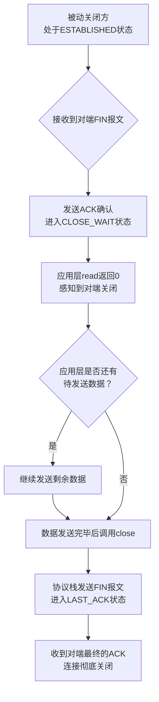

## 1  **TCP 四次挥手详解：被动关闭方 (`CLOSE_WAIT`) 的行为**

1.  **`CLOSE_WAIT` 状态何时产生？**
    当被动关闭方收到主动关闭方发来的 `FIN` 报文（表示对方数据已发完）后，它必须立即回应一个 `ACK`。发送此 `ACK` 后，TCP 连接状态即变为 **`CLOSE_WAIT`**。

2.  **`CLOSE_WAIT` 状态下，何时发送 `FIN` 包？**
    -   **核心原则**：确保在 `CLOSE_WAIT` 状态期间，将**所有需要发送给对端的剩余应用数据全部发送完毕**。
    -   **流程**：应用层通过 `read()` 返回 0 感知到对方发起关闭。如果应用层还有待发送数据，则继续调用 `write()/send()` 将数据放入发送缓冲区，由 TCP 协议栈发出。**在所有应用数据发送完毕后**，应用层调用 `close()` 或 `shutdown(SHUT_WR)`，此时 TCP 协议栈才会构建并发送 `FIN` 报文。随后状态转为 **`LAST_ACK`**。

3.  **写缓冲区与 `FIN` 的关系**
    `FIN` 报文的发送**严格依赖于写缓冲区的状态**。调用 `close()` 时，只有当该连接方向的**写缓冲区中所有已排队的数据都被成功发送出去后，`FIN` 报文才会作为最后一个报文被发出**。这保证了数据的可靠传输与顺序性。

4.  **应用层如何感知对端关闭？ (`read` 返回 0 的真正含义)**
    - 主动关闭方发送 `FIN` 的行为，被协议栈翻译为一个传递给应用层的 "**流结束（End-of-Stream）**" 信号。
    - 当被动关闭方的应用层调用 `read()` 时，如果：
        1.  接收缓冲区有数据，则返回数据。
        2.  接收缓冲区无数据，且对端已发送 `FIN`（即连接方向已关闭），则 `read()` **返回 0**。
    - 这个返回值 0 就是应用层需要处理的 "**EOF 条件**"，它通知应用程序：通信对端已经完成了它的数据发送任务。
5.  **发送 FIN 后，写缓冲区是否为空**
	- **在正常情况下，主动发送 FIN 的一端，其写缓冲区在发送 FIN 的瞬间必须为空，这是 TCP 协议可靠性和有序性的要求。**

## 2  **核心流程总结图**

为了更直观地理解被动关闭方的完整流程，可以参考下面的处理路径：

## 3  **关键要点与注意事项**

-   **`CLOSE_WAIT` 状态是 " 被动 " 的**：它本身只是一个等待本地应用层发出关闭指令的中间状态。
-   **`CLOSE_WAIT` 状态过多通常是应用 Bug**：如果服务器上出现大量持久的 `CLOSE_WAIT` 状态连接，通常是因为应用程序在检测到 `read()` 返回 0 后，**没有正确地调用 `close()` 来关闭套接字**，导致连接一直挂在这个状态，是一种资源泄漏。
-   **主动与被动角色是方向性的**：一个 TCP 连接的两个端点都可以主动发起关闭。通常先调用 `close()` 的一方被视为主动关闭方，但 API 允许双向独立关闭。
