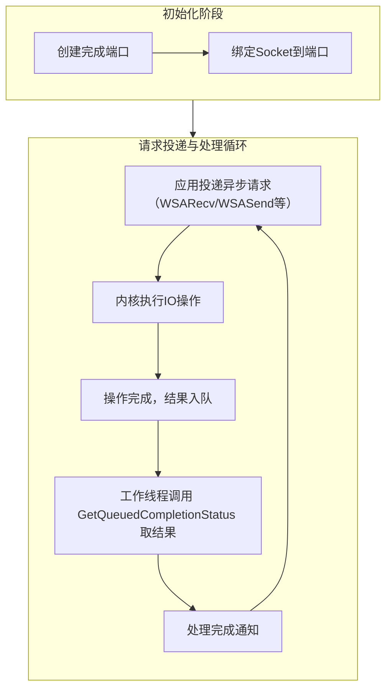

## 1  **Reactor vs. IOCP：两种高性能 IO 模型核心解析**

二者同属**事件驱动**架构，将对 IO 的处理转化为对事件的处理，从而高效管理海量并发连接。但其核心设计理念与实现方式有本质区别。

### 1.1  **核心对比：设计哲学与事件差异**

| 特性           | **Reactor (同步非阻塞 IO)**                                               | **IOCP (异步非阻塞 IO)**                                                                                  |
| :----------- | :------------------------------------------------------------------- | :--------------------------------------------------------------------------------------------------- |
| **核心事件**     | **就绪事件**                                                             | **完成事件**                                                                                             |
| **IO 操作执行者** | **应用程序** (用户态)                                                       | **操作系统内核** (内核态)                                                                                     |
| **工作模式**     | 1. 通知用户 "IO**可读/可写**" 了。<br>2. 用户**亲自调用** `read`/`write` 等函数来完成数据搬移。 | 1. 用户提交 "**读取/发送**这些数据 " 的请求。<br>2. 内核**完全负责**执行 IO 和数据搬移。<br>3. 完成后通知用户 " 你要的 IO 操作**已搞定**，结果在这里 "。 |
| **编程模型**     | 同步非阻塞，基于回调或状态机。                                                      | 异步，基于完成通知和回调。                                                                                        |

---

## 2  **关键概念辨析**

### 2.1  **阻塞 (Blocking) vs. 非阻塞 (Non-blocking)**

-   **关注点**：**发起 IO 请求时，线程是否需要等待**。
-   **阻塞 IO**：调用 `recv()`，若数据未就绪，线程会一直挂起，直到数据到达。
-   **非阻塞 IO**：调用 `recv()`，若数据未就绪，函数**立即返回一个错误码**，线程可以继续执行其他任务。需要配合轮询或事件通知机制。

### 2.2  **同步 (Synchronous) vs. 异步 (Asynchronous)**

-   **关注点**：**IO 操作（数据就绪到搬移完成的全过程）的执行方式**。
-   **同步 IO**：应用在**整个 IO 操作完成前**都需要等待或主动检查。Reactor 中的 `read`/`write` 调用是同步的。
-   **异步 IO**：应用**提交请求后立即返回**，操作系统在后台完成整个操作（包括数据在内核与用户缓冲区间的搬移），然后通知应用。

> **重要**：Reactor 模式常被称为 **同步非阻塞**，这里的 " 同步 " 指的是用户需要亲自执行数据搬移这个 " 同步 " 操作。

---

## 3  **IOCP 深入解析**

### 3.1  核心工作流程

IOCP 的实现遵循一套固定的异步工作流，下图清晰地展示了从创建到处理完成的完整生命周期：



### 3.2  关键数据结构与关联

IOCP 通过以下两个关键参数将事件、请求和连接精确关联起来：

-   **`CompletionKey` (连接键)**：
    - 在 `CreateIoCompletionPort` 绑定时传入，通常是一个指向**连接对象**的指针。
    - 用于在完成通知中**标识是哪个连接**触发了事件。
-   **`LPOVERLAPPED` (重叠结构)**：
    - 在 `WSARecv`、`WSASend` 等异步调用时传入，是每个 IO 请求的 " 身份证 "。
    - 用于在完成通知中**标识是哪个具体的请求**（如 " 连接 A 的第一次接收请求 "）。
    - 通常作为用户自定义上下文结构 (`IOContext`) 的基类，其中可以扩展 `IOType`、数据缓冲区等字段。

---

```cpp
// 示例：自定义的IO上下文结构
struct IOContext {
    OVERLAPPED overlapped; // 必须作为第一个成员，用于标识请求
    IOType type;           // 用户定义：是 READ、WRITE 还是 ACCEPT 操作
    char buffer[8192];     // 数据缓冲区
    // … 其他连接相关数据
};

// 完成通知获取关联信息
BOOL GetQueuedCompletionStatus(
    …,
    PULONG_PTR lpCompletionKey, // 输出：获取到我们绑定的连接指针
    LPOVERLAPPED* lpOverlapped, // 输出：获取到此次请求的 OVERLAPPED 指针
    …
);
// 通过 lpOverlapped 可以转换为 IOContext*，从而知道操作类型和数据。
// 通过 lpCompletionKey 可以知道属于哪个连接对象。
```

### 3.3  多线程模型建议

-   **主线程**：通常负责监听、接受新连接 (`AcceptEx`)，并将新连接绑定到 IOCP。
-   **工作线程池**：多个线程同时调用 `GetQueuedCompletionStatus` 等待完成事件。当某个 IO 操作完成，系统会唤醒一个正在等待的线程来处理该完成通知。这种模型**天然负载均衡**，能充分利用多核。

### 3.4  " 链式 " 工作流

IOCP 的高性能秘诀在于维持一个**持续的异步操作流水线**，避免因等待而阻塞：

-   **`AcceptEx`**：在接受一个连接后，应立即为下一个连接再次投递 `AcceptEx` 请求。
-   **`WSARecv`**：在完成一次数据接收并处理后，应立即为同一连接再次投递 `WSARecv` 请求，以持续接收后续数据。
-   **`WSASend`**：当有数据需要发送时投递。注意需管理发送缓冲区，避免重叠的发送请求。

这种 " 完成 -> 处理 -> 立即投递下一个 " 的循环，构成了高效且无阻塞的异步链式工作流。
